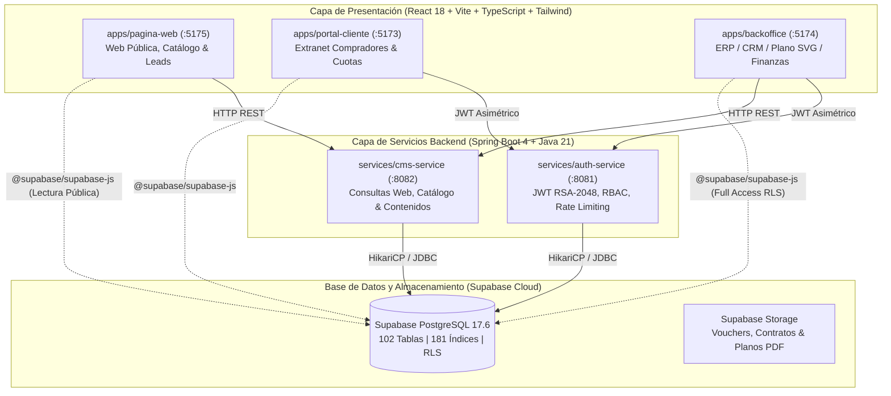
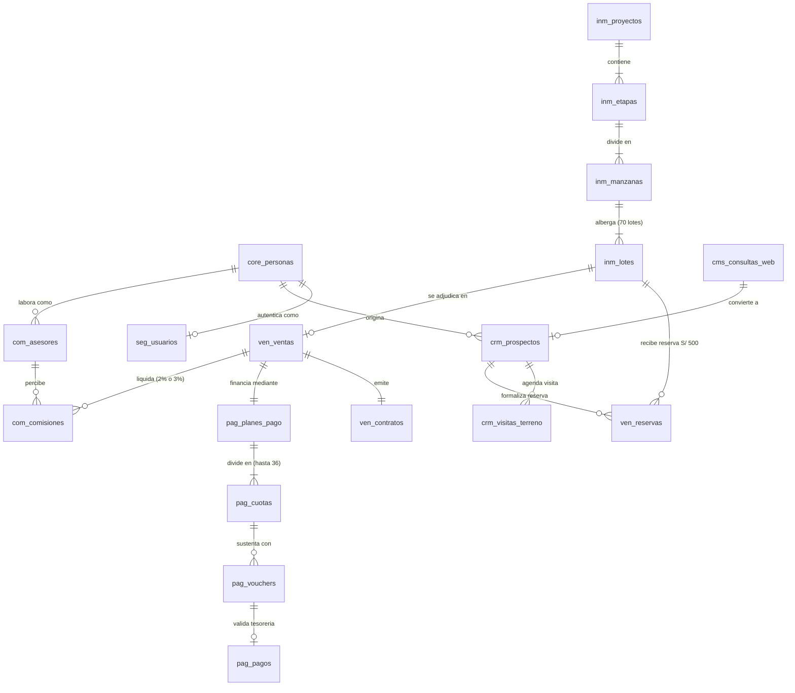
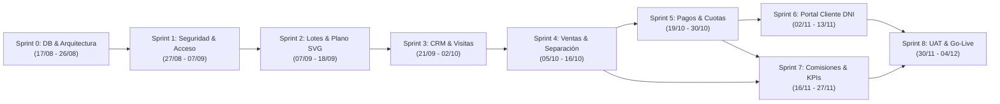

# SGI-Monolithe — Sistema Integral de Gestión Inmobiliaria

**Arquitectura Monorepo Híbrida Desacoplada**  
*Backoffice ERP/CRM (React 18) | Portal de Clientes (React 18) | Web Pública (React 18) | Microservicios Java 21 & Spring Boot 4 | Base de Datos Supabase (PostgreSQL 17.6)*

---

## Badges del Ecosistema Tecnológico


---

## Tabla de Contenidos

1. [Visión General, Alcance y Objetivos](#1-visión-general-alcance-y-objetivos)
2. [Reglas de Negocio Oficiales e Inmutables](#2-reglas-de-negocio-oficiales-e-inmutables)
3. [Arquitectura General del Sistema (Monorepo Híbrido)](#3-arquitectura-general-del-sistema-monorepo-híbrido)
4. [¿Por qué esta Arquitectura? Decisiones de Ingeniería](#4-por-qué-esta-arquitectura-decisiones-de-ingeniería)
5. [Catálogo de Aplicaciones Frontend (`apps/`)](#5-catálogo-de-aplicaciones-frontend-apps)
6. [Catálogo de Servicios Backend (`services/`)](#6-catálogo-de-servicios-backend-services)
7. [Base de Datos y Almacenamiento (`database/`)](#7-base-de-datos-y-almacenamiento-database)
8. [Estructura Detallada del Repositorio](#8-estructura-detallada-del-repositorio)
9. [Cronograma Gantt Maestro y Estado de Sprints](#9-cronograma-gantt-maestro-y-estado-de-sprints)
10. [Políticas Estrictas de Seguridad y Manejo de Secretos](#10-políticas-estrictas-de-seguridad-y-manejo-de-secretos)
11. [Flujo de Trabajo en GitHub y Estándares de Código](#11-flujo-de-trabajo-en-github-y-estándares-de-código)
12. [Guía de Arranque Rápido (Local y Docker)](#12-guía-de-arranque-rápido-local-y-docker)
13. [Prompt de Asistencia de IA para el Equipo](#13-prompt-de-asistencia-de-ia-para-el-equipo)

---

## 1. Visión General, Alcance y Objetivos

**SGI-Monolithe** es la plataforma tecnológica central diseñada para automatizar y escalar integralmente las operaciones comerciales, administrativas, financieras y legales de desarrollos inmobiliarios y proyectos de habilitación urbana.

### Alcance del Proyecto
El sistema gestiona de forma centralizada todo el ciclo de vida inmobiliario:
* **Captación y Lead Management:** Formulario web de prospectos, integración con WhatsApp Business API e historial de seguimiento comercial en CRM.
* **Control Físico y Plano SVG Interactivo:** Gestión dinámica de disponibilidad de lotes (70 lotes del Proyecto Habilitación Urbana), filtrado visual por manzanas, rangos de área ($m^2$) y precio en dólares/soles.
* **Proceso de Separación y Venta:** Registro de separaciones con monto oficial ($S/\ 500.00$), bloqueo temporal por 7 días calendario, generación automática de contratos de compraventa y formalización de clientes.
* **Motor Financiero y Extranet del Cliente:** Control de financiamiento directo de 1 a 36 cuotas, cálculo automatizado de mora, panel de Tesorería para validación de vouchers de pago y Portal de Autoservicio para clientes con autenticación por DNI.
* **Cálculo Automatizado de Comisiones:** Liquidación de comisiones para asesores (3% en ventas al contado, 2% en ventas financiadas) y métricas en tiempo real.

---

## 2. Reglas de Negocio Oficiales e Inmutables

El desarrollo del software responde estrictamente a las reglas del **Documento Maestro de Especificaciones Técnicas**:

| Dominio | Regla de Negocio | Impacto en Arquitectura / Base de Datos |
|---|---|---|
| **Separación** | Monto fijo de $S/\ 500.00$ con un plazo máximo de **7 días calendario** de reserva. | El backend ejecuta una tarea programada para liberar lotes expirados a `Disponible`. |
| **Moneda Base** | Los precios principales se cotizan en **Dólares ($)**, pero se admite pago equivalente en **Soles (S/)** según tipo de cambio oficial. | Tablas `lotes` y `transacciones` almacenan `precio_usd`, `precio_pen` y `tipo_cambio_aplicado`. |
| **Financiamiento** | De 1 a **36 cuotas mensuales**. Interés aplicable según plazo. | Generación de tabla `cronograma_pagos` en BD con estados `POR_VENCER`, `PAGADO`, `VENCIDO`. |
| **Resolución** | La acumulación de **3 cuotas impagas consecutivas** es causal de resolución de contrato y reversión del lote a `Disponible`. | Alerta automática en Dashboard y marcado de contrato como `EN_RESOLUCION`. |
| **Comisiones** | **3%** para ventas al contado / **2%** para ventas financiadas. Pagadero tras validación de la cuota inicial / separación confirmada. | Motor de liquidación en `services/auth-service` y reportes en Backoffice. |
| **Clientes DNI** | Clientes acceden a su portal privado utilizando su **DNI** como usuario y contraseña inicial temporal. | Servicio de autenticación autogenera hash BCrypt con expiración en el primer login. |

---

## 3. Arquitectura General del Sistema (Monorepo Híbrido)

He implementado una **Arquitectura Híbrida Modular** que combina la simplicidad de despliegue de un monorepo con el desacoplamiento de servicios REST independientes y la persistencia administrada en la nube mediante Supabase Cloud:



---

## 4. ¿Por qué esta Arquitectura? Decisiones de Ingeniería

1. **Desacoplamiento Front/Back:** Los frontends se compilan como Single Page Applications (SPAs) ultra rápidas con Vite. La lógica pesada de negocio reside en Java/Spring Boot.
2. **Criptografía y Llaves Asimétricas:** `services/auth-service` firma tokens JWT utilizando claves asimétricas RSA de 2048 bits (`jwt-private.pem`). La clave privada reside strictly en el backend protegida por el sistema operativo, nunca expuesta a clientes web.
3. **Resiliencia contra Ataques de Fuerza Bruta:** He integrado **Bucket4j** en Spring Boot para aplicar limitación de tasa (*rate limiting*) sobre los endpoints de inicio de sesión, mitigando ataques antes de consultar la base de datos.
4. **Validación Transaccional Estricta:** Hibernate (`ddl-auto=validate`) valida que las entidades Java correspondan exactamente al esquema físico de PostgreSQL 17, impidiendo corrupción de datos.

> **En síntesis:**  
> **Supabase** es el **Músculo y la Memoria** (PostgreSQL 17 de alta disponibilidad, RLS y almacenamiento de archivos).  
> **Spring Boot** es el **Cerebro y la Ley** (Lógica de negocio, seguridad criptográfica, validaciones y contratos).  
> **React + Vite** es la **Cara** (Interfaces fluidas y accesibles para usuarios, clientes y administradores).

---

## 5. Catálogo de Aplicaciones Frontend (`apps/`)

### 1. Web Pública (`apps/pagina-web` - Puerto `:5175`)
* **Propósito:** Portal público comercial orientado a la captación de leads y exhibición del proyecto inmobiliario.
* **Componentes:** Hero con slider de imágenes, catálogo dinámico de lotes disponibles, cotizador en línea y formulario de contacto directo sincronizado con la tabla `consultas_web`.

### 2. Portal del Cliente (`apps/portal-cliente` - Puerto `:5173`)
* **Propósito:** Extranet de autoservicio para compradores.
* **Componentes:** Autenticación por DNI, dashboard personal con avance de pago, cronograma dinámico de cuotas, módulo para subir comprobantes/vouchers de pago y descarga de contratos en PDF.

### 3. Backoffice ERP/CRM (`apps/backoffice` - Puerto `:5174`)
* **Propósito:** Panel administrativo central para ventas, tesorería, gerencia y asesores comerciales.
* **Componentes:** Plano interactivo SVG con 70 lotes vectoriales y cambio de estados en tiempo real, CRM de prospectos (Kanban), módulo de ventas y separaciones, validación de vouchers de pago y panel de comisiones.

---

## 6. Catálogo de Servicios Backend (`services/`)

### 1. Auth Service (`services/auth-service` - Puerto `:8081`)
* **Tecnología:** Java 21 LTS + Spring Boot 3.4.1 + Spring Security.
* **Funcionalidad:** Emisión y validación de JWT con firma RSA-2048, control de acceso basado en roles (RBAC: `ROLE_ADMIN`, `ROLE_ASESOR`, `ROLE_CLIENTE`, `ROLE_TESORERIA`), auditoría de intentos fallidos y rate limiting con Bucket4j.

### 2. CMS & Consultas Service (`services/cms-service` - Puerto `:8082`)
* **Tecnología:** Java 21 LTS + Spring Boot 3.4.1 + Spring Data JPA.
* **Funcionalidad:** API REST para ingesta de consultas web, gestión del catálogo comercial, información de proyectos y orquestación de correos electrónicos transaccionales.

---

## 7. Base de Datos y Almacenamiento (`database/`)

El modelo relacional esta desplegado sobre **PostgreSQL 17.6** en **Supabase Cloud** (region `us-west-2`). Cuenta con **102 tablas normalizadas** bajo Tercera Forma Normal (3NF), **181 indices** de alto rendimiento, claves foraneas estrictas y politicas **Row Level Security (RLS)** activadas por perfil de usuario.

### 7.1. Diagrama Entidad-Relacion Core (Flujo Transaccional)



### 7.2. Catalogo de Tablas por Dominio y Modulo (102 Tablas)

El modelo de datos se estructura en prefijos funcionales que organizan las 102 tablas del sistema:

| Prefijo / Modulo | Nro. Tablas | Tablas Principales | Responsabilidad de Negocio |
|---|:---:|---|---|
| **`cfg_` (Configuracion)** | 41 | `cfg_estados_lote`, `cfg_estados_reserva`, `cfg_estados_venta`, `cfg_estados_cuota`, `cfg_metodos_pago`, `cfg_estados_voucher`, `cfg_tipos_asesor`, `cfg_estados_comision` | Catalogos inmutables de estados, tipos de documento, monedas, tarifas y parametros maestros del sistema. |
| **`core_` (Entidades Base)** | 4 | `core_personas`, `core_personas_documentos`, `core_personas_contactos`, `core_personas_direcciones` | Repositorio maestro de identidad: clientes, prospectos, asesores y administradores sin duplicacion de datos personales. |
| **`seg_` (Seguridad & RBAC)** | 7 | `seg_usuarios`, `seg_roles`, `seg_permisos`, `seg_usuarios_roles`, `seg_roles_permisos`, `seg_sesiones`, `aud_eventos` | Control de acceso basado en roles (`ADMIN`, `ASESOR`, `TESORERIA`, `CLIENTE`), registro de sesiones y auditoria de seguridad. |
| **`inm_` (Inventario Inmobiliario)** | 8 | `inm_proyectos`, `inm_etapas`, `inm_manzanas`, `inm_lotes`, `inm_tarifas`, `inm_planos_interactivos`, `inm_multimedia_lote`, `inm_ajustes_precio` | Catalogo territorial de los **70 lotes**, metrajes, precios por m2, poligonos para planos vectoriales SVG y estado fisico (`Disponible`, `Separado`, `Vendido`, `Bloqueado`). |
| **`crm_` (Gestion Comercial)** | 5 | `crm_prospectos`, `crm_seguimientos`, `crm_visitas_terreno`, `crm_consentimientos`, `crm_origenes` | Embudo de ventas, asignacion de asesores, historial de llamadas y agenda de visitas al terreno (L/M/V/S 11:00 AM y 03:00 PM). |
| **`ven_` (Ventas y Separaciones)** | 6 | `ven_reservas`, `ven_ventas`, `ven_contratos`, `ven_documentos_venta`, `ven_titulares`, `ven_minutas` | Registro de separacion preventiva de **S/ 500.00** con control de caducidad a **7 dias calendario**, formalizacion de venta y generacion de contrato. |
| **`pag_` (Financiamiento & Cuotas)** | 6 | `pag_planes_pago`, `pag_cuotas`, `pag_vouchers`, `pag_pagos`, `pag_aplicaciones_pago`, `pag_comprobantes` | Simulacion y generacion del cronograma de **hasta 36 cuotas**, verificacion de vouchers por tesoreria y alerta por **3 cuotas vencidas** (causal resolutoria). |
| **`com_` (Comisiones)** | 6 | `com_asesores`, `com_reglas_comision`, `com_comisiones`, `com_liquidaciones`, `com_bonos`, `com_descuentos` | Motor de calculo de comisiones: **3% para venta al contado** y **2% para venta financiada**, condicionada a la firma del contrato formal con cuota inicial cancelada. |
| **`cms_` (Web Publica & Leads)** | 5 | `cms_consultas_web`, `cms_paginas`, `cms_secciones`, `cms_multimedia`, `cms_parametros` | Recepcion de consultas web desde `apps/pagina-web`, contenido editable de paginas institucionales y configuracion de banners. |
| **`fin_` & `not_` (Tesoreria & Alertas)** | 14 | `fin_cuentas_bancarias`, `fin_movimientos`, `not_notificaciones`, `not_envios`, `not_plantillas` | Conciliacion de cuentas de la empresa y despacho de alertas transaccionales (vencimientos y aprobacion de vouchers). |

### 7.3. Flujo Transaccional de Datos entre Tablas

```text
1. Visitante envia formulario web           -> Insercion en cms_consultas_web
2. Asesor califica la consulta             -> Creacion en core_personas + crm_prospectos
3. Prospecto agenda visita al terreno       -> Registro en crm_visitas_terreno (L/M/V/S)
4. Cliente abona S/ 500 para reservar lote  -> Registro en ven_reservas, lote pasa a Separado (7 dias)
5. Cliente abona cuota inicial              -> Registro en ven_ventas + ven_contratos, lote pasa a Vendido
6. Sistema genera plan de financiamiento   -> Insercion en pag_planes_pago + 36 filas en pag_cuotas
7. Cliente sube comprobante mensual en DNI -> Creacion en pag_vouchers (Estado: Pendiente)
8. Tesoreria revisa y aprueba voucher       -> Insercion en pag_pagos + actualizacion de cuota a Pagada
9. Desembolso comercial tras contrato       -> Liquidacion en com_comisiones (3% contado o 2% financiado)
```

### 7.4. Almacenamiento en Supabase Storage

Los documentos binarios residen en buckets privados de Supabase con URLs firmadas temporales:
* **`vouchers/`**: Comprobantes de transferencia y depositos bancarios subidos por compradores.
* **`contratos/`**: Copias digitales firmadas de contratos de compraventa y minutas en formato PDF.
* **`planos/`**: Archivos vectoriales y planos de habilitacion urbana asociados a `inm_planos_interactivos`.

---

## 8. Estructura Detallada del Repositorio

He organizado el árbol de archivos bajo el patrón estándar de Monorepos de la industria:

```text
SGI-Monolithe/
├── apps/                               # Aplicaciones Frontend (React 18 + Vite)
│   ├── pagina-web/                     # Web pública y captación de prospectos (5175)
│   ├── portal-cliente/                 # Extranet privada de compradores (5173)
│   └── backoffice/                     # Sistema ERP / CRM / Ventas / Finanzas (5174)
│
├── services/                           # Servicios Backend (Spring Boot 4 + Java 21)
│   ├── auth-service/                   # Servicio de Autenticación, JWT RSA y RBAC (8081)
│   └── cms-service/                    # Servicio de CMS y Consultas Web (8082)
│
├── database/                           # Control Unificado de Base de Datos
│   ├── migrations/                     # Scripts SQL DDL versionados de tablas e índices
│   ├── seeds/                          # Datos iniciales (catálogos, roles, estados semilla)
│   ├── scripts/                        # Scripts SQL auxiliares y de verificación
│   └── supabase/                       # Configuración local de Supabase
│
├── docs/                               # Documentación Técnica Oficial (SSOT)
│   ├── 01_gestion_proyecto/            # Cronograma Gantt oficial (Markdown y XML)
│   ├── 02_requerimientos_especificaciones/ # Documento Maestro de Requerimientos y Sprints
│   ├── 04_transcripciones_analisis/    # Reglas de negocio consolidadas de reuniones
│   └── 05_base_de_datos/               # Esquemas y guías de configuración de base de datos
│
├── scripts/                            # Herramientas de Automatización
│   ├── iniciar_local.sh                # Script de arranque con un solo clic
│   ├── probar_pagina_web.sh            # Smoke test automatizado de persistencia y APIs
│   └── check_db_tables.cjs             # Comprobador de integridad de tablas Supabase
│
├── .secret/                            # SECRETOS LOCALES (Ignorado en Git - chmod 700)
│   ├── keys/                           # Llaves criptográficas RSA (jwt-private.pem, chmod 600)
│   └── supabase.env                    # Credenciales de conexión Supabase (chmod 600)
│
├── .env.example                        # Plantilla pública sin secretos sensibles
├── docker-compose.yml                  # Orquestador multi-contenedor de todo el sistema
└── README.md                           # Documento principal de referencia técnica
```

---

## 9. Cronograma Gantt Maestro y Estado de Sprints

He alineado las tareas del proyecto con el **Diagrama de Gantt Oficial (263 tareas)** y el modelo entidad-relación de Supabase:



| Sprint | Fechas | Horas | Alcance y Entregables | Estado |
|---|:---:|:---:|---|:---:|
| **Sprint 0** | 17/08 – 26/08 | 64h | Modelo ER de 102 tablas en Supabase, migraciones DDL, datos semilla y wireframes de Figma. | **100% COMPLETADO** |
| **Sprint 1** | 27/08 – 07/09 | 80h | Seguridad y acceso: JWT con llaves RSA-2048, roles RBAC y tabla de auditoría `aud_eventos`. | **90% COMPLETADO** |
| **Sprint 2** | 07/09 – 18/09 | 192h | Catálogo inmobiliario y plano SVG interactivo de los **70 lotes** con estados dinámicos. | **85% UI / 100% DB** |
| **Sprint 3** | 21/09 – 02/10 | 80h | CRM inmobiliario, captura de prospectos y agenda de visitas en horarios oficiales. | **85% UI / 100% DB** |
| **Sprint 4** | 05/10 – 16/10 | 88h | Separaciones de S/ 500 (plazo 7 días), generación de contratos y formalización de clientes. | **85% UI / 100% DB** |
| **Sprint 5** | 19/10 – 30/10 | 80h | Financiamiento directo (hasta 36 cuotas), panel de tesorería y validación de vouchers. | **80% UI / 100% DB** |
| **Sprint 6** | 02/11 – 13/11 | 80h | Portal de autoservicio para clientes con DNI, consulta de cuotas y carga de comprobantes. | **90% UI / 100% DB** |
| **Sprint 7** | 16/11 – 27/11 | 80h | Motor automatizado de comisiones (2% y 3%) y métricas gerenciales (KPIs de recaudación). | **75% UI / 100% DB** |
| **Sprint 8** | 30/11 – 04/12 | 40h | Pruebas de aceptación de usuario (UAT), hardening de seguridad y despliegue final Go-Live. | **Planificado** |

---

## 10. Políticas Estrictas de Seguridad y Manejo de Secretos

Para evitar incidentes de seguridad en el repositorio público o de equipo, he establecido las siguientes normas obligatorias:

1. **Aislamiento Absoluto de Credenciales (`.secret/`):**
   * Toda variable sensible (`SUPABASE_ANON_KEY`, `SUPABASE_SERVICE_ROLE_KEY`, contraseñas de BD) reside exclusivamente en `.secret/supabase.env`.
   * Este archivo y las llaves privadas RSA tienen permisos estrictos del sistema de archivos:
     ```bash
     chmod 700 .secret .secret/keys
     chmod 600 .secret/supabase.env .secret/keys/*.pem
     ```
2. **Exclusión en Control de Versiones:**
   * Las reglas del archivo `.gitignore` prohíben explícitamente rastrear `.secret/`, carpetas `secrets/`, archivos `.env`, `.pem` y `.key`.
3. **Manejo de Llaves Criptográficas:**
   * La llave privada `jwt-private.pem` **nunca se comparte**. Si no existe en el entorno local, el script `iniciar_local.sh` genera un par criptográfico nuevo automáticamente en el equipo local.
4. **Principio de Mínimo Privilegio en Frontend:**
   * Los frontends únicamente conocen la `ANON_KEY` de Supabase, protegida por RLS. La `SERVICE_ROLE_KEY` (clave maestra) nunca se inyecta en ninguna aplicación web del cliente.

---

## 11. Flujo de Trabajo en GitHub y Estándares de Código

He adoptado un flujo de trabajo ágil basado en ramas protegidas y convenciones semánticas:

### Estrategia de Ramas
* **`main`**: Rama de producción lista para despliegue. Protegida contra pushes directos; solo admite cambios mediante Pull Requests aprobados.
* **`develop`**: Rama integradora de desarrollo activo donde convergen las funcionalidades finalizadas.
* **`feature/nombre-funcionalidad`**: Ramas de trabajo individuales (ejemplo: `feature/jjgs-backend`, `feature/lotes-svg-interactivo`).

### Convención de Commits (Conventional Commits)
Cada confirmación de código debe seguir el formato estándar:
* `feat(modulo): descripción de la nueva funcionalidad implementada`
* `fix(seguridad): corrección de un defecto o vulnerabilidad`
* `refactor(arquitectura): reorganización de código sin alterar comportamiento`
* `docs(readme): actualización de manuales o documentación técnica`
* `test(auth): adición o corrección de pruebas unitarias o de integración`

---

## 12. Guía de Arranque Rápido (Local y Docker)

### Prerrequisitos en tu Computadora
* **Git** instalado.
* **Docker & Docker Compose** (para levantar contenedores) o **Node.js 20+** y **Java 21 LTS** (para ejecución directa en consola).

---

### Opción 1: Arranque Local Automático (Recomendado para Desarrollo)
He programado un script en Bash que prepara el entorno, genera las llaves RSA si faltan y levanta los servicios:

```bash
# 1. Clonar el repositorio
git clone https://github.com/Adrianny16/SGI-Monolithe.git
cd SGI-Monolithe

# 2. Ejecutar el script automatizado
bash scripts/iniciar_local.sh
```

El script validará la conexión con Supabase, verificará el backend en el puerto `8082` y lanzará la interfaz web en `http://localhost:5175`.

---

### Opción 2: Arranque Completo con Docker Compose
Si deseas levantar la totalidad de los contenedores (servicios y aplicaciones) en un entorno homogéneo:

```bash
docker compose up --build
```

### Matriz de Servicios y Puertos
Una vez iniciado el sistema, los puntos de acceso locales son:

| Servicio | URL Local | Descripción |
|---|---|---|
| **Página Web Pública** | `http://localhost:5175` | Catálogo de proyectos y formulario de leads. |
| **Portal del Cliente** | `http://localhost:5173` | Extranet de compradores (acceso por DNI). |
| **Backoffice Inmobiliario** | `http://localhost:5174` | ERP/CRM, plano interactivo de 70 lotes y ventas. |
| **Backend Auth API** | `http://localhost:8081` | Microservicio de autenticación, JWT y RBAC. |
| **Backend CMS API** | `http://localhost:8082` | Microservicio de contenidos y consultas web. |

---

## 13. Prompt de Asistencia de IA para el Equipo

Si algún compañero del equipo utiliza herramientas de Inteligencia Artificial (como **GitHub Copilot**, **Antigravity** o **Claude**) para programar en este repositorio, debe proveerle el siguiente prompt inicial para garantizar coherencia con la arquitectura:

```text
Actúa como Ingeniero de Software Senior en el proyecto SGI-Monolithe.

CONTEXTO DEL PROYECTO:
- Arquitectura: Monorepo modular desacoplado.
- Frontend: 3 aplicaciones React 18 + Vite + TypeScript + Tailwind CSS (apps/pagina-web :5175, apps/portal-cliente :5173, apps/backoffice :5174).
- Backend: Microservicios en Java 21 LTS + Spring Boot 4.1.1 (services/auth-service :8081, services/cms-service :8082) con Spring Security, JWT RSA-2048 y Bucket4j.
- Persistencia: Supabase Cloud (PostgreSQL 17.6) con 102 tablas relacionales, RLS activado y Supabase Storage para vouchers y contratos PDF.

REGLAS DE DESARROLLO:
1. Respeta el diseño Clean Architecture y principios SOLID. Funciones con responsabilidad única (<= 20 líneas).
2. Prohibido exponer secretos o editar archivos fuera de .secret/ para credenciales. Las variables sensibles tienen permisos chmod 600.
3. Las reglas de negocio (separación de S/ 500 a 7 días, financiamiento hasta 36 cuotas, causal de resolución por 3 cuotas impagas y comisiones de 2% y 3%) residen y se validan en el backend.
4. Genera código con tipado estricto en TypeScript y maneja excepciones tipadas en Java (prohibido catch vacíos o printStackTrace).
```

---

*Documentación técnica elaborada y validada por el equipo de desarrollo de **SGI-Monolithe**.*
