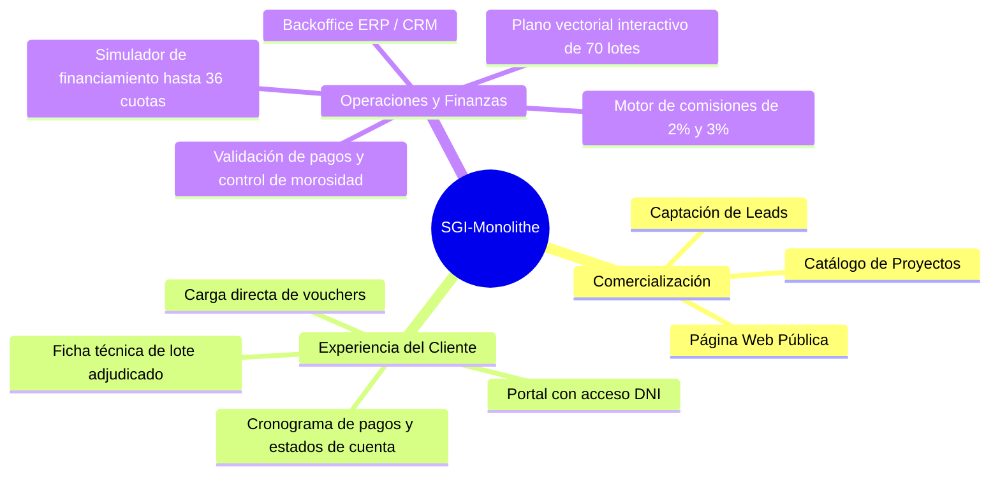
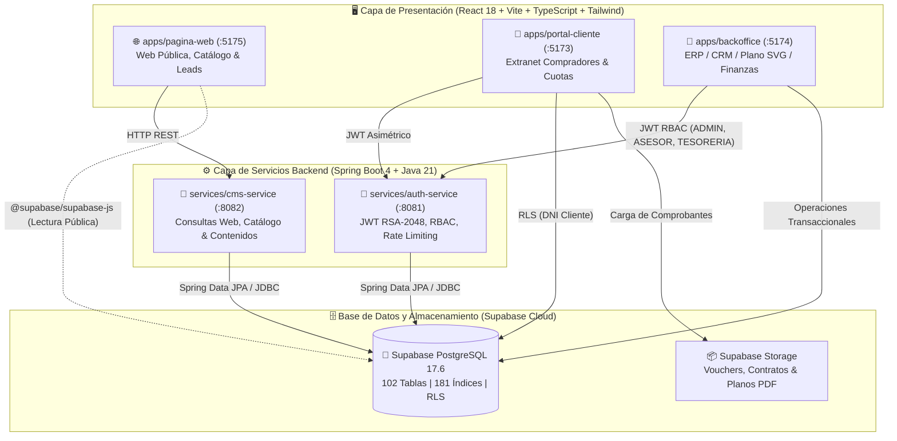
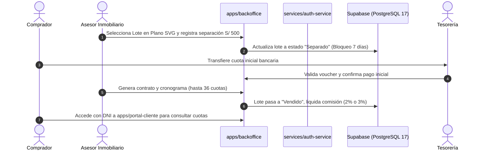
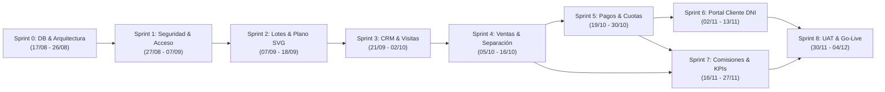

# 🏢 SGI-Monolithe — Sistema Integral de Gestión Inmobiliaria

> **Presentación Oficial del Proyecto:** He diseñado y estructurado **SGI-Monolithe** como la plataforma tecnológica centralizada de grado empresarial para la habilitación urbana y comercialización inmobiliaria. Este ecosistema cubre el ciclo de vida completo del negocio: desde la captación digital de prospectos y visualización interactiva de planos en tiempo real, hasta la formalización de contratos de compraventa, financiamiento directo en cuotas y liquidación automatizada de comisiones.

---

## 📌 Badges del Ecosistema Tecnológico

[](https://www.oracle.com/java/)
[](https://spring.io/projects/spring-boot)
[](https://react.dev/)
[](https://www.typescriptlang.org/)
[](https://vitejs.dev/)
[](https://supabase.com/)
[](https://tailwindcss.com/)
[](https://www.docker.com/)

---

## 📑 Tabla de Contenidos
1. [Visión General, Alcance y Objetivos](#-1-visión-general-alcance-y-objetivos)
2. [Reglas de Negocio Oficiales e Inmutables](#-2-reglas-de-negocio-oficiales-e-inmutables)
3. [Arquitectura General del Sistema (Monorepo Híbrido)](#-3-arquitectura-general-del-sistema-monorepo-híbrido)
4. [¿Por qué esta Arquitectura? Decisiones de Ingeniería](#-4-por-qué-esta-arquitectura-decisiones-de-ingeniería)
5. [Catálogo de Aplicaciones Frontend (`apps/`)](#-5-catálogo-de-aplicaciones-frontend-apps)
6. [Catálogo de Servicios Backend (`services/`)](#-6-catálogo-de-servicios-backend-services)
7. [Base de Datos y Almacenamiento (`database/`)](#-7-base-de-datos-y-almacenamiento-database)
8. [Estructura Detallada del Repositorio](#-8-estructura-detallada-del-repositorio)
9. [Cronograma Gantt Maestro y Estado de Sprints](#-9-cronograma-gantt-maestro-y-estado-de-sprints)
10. [Políticas Estrictas de Seguridad y Manejo de Secretos](#-10-políticas-estrictas-de-seguridad-y-manejo-de-secretos)
11. [Flujo de Trabajo en GitHub y Estándares de Código](#-11-flujo-de-trabajo-en-github-y-estándares-de-código)
12. [Guía de Arranque Rápido (Local y Docker)](#-12-guía-de-arranque-rápido-local-y-docker)
13. [Prompt de Asistencia de IA para el Equipo](#-13-prompt-de-asistencia-de-ia-para-el-equipo)

---

## 🎯 1. Visión General, Alcance y Objetivos

He concebido este proyecto para digitalizar y automatizar integralmente las operaciones comerciales y financieras de una empresa inmobiliaria. El sistema resuelve tres necesidades críticas:

1. **Presencia Pública y Captación:** Una vitrina web ágil donde los interesados exploran el catálogo de proyectos y solicitan asesoría comercial.
2. **Autoservicio y Transparencia para el Comprador:** Un portal privado para que los clientes consulten el estado de sus lotes, cronogramas de pago y carguen sus comprobantes de depósito sin depender de llamadas telefónicas.
3. **Control Operativo Integral (ERP/CRM):** Un centro de operaciones unificado para que la gerencia, asesores y tesorería administren el inventario físico, gestionen prospectos, emitan contratos y liquiden comisiones.



---

## ⚖️ 2. Reglas de Negocio Oficiales e Inmutables

He codificado las reglas del dominio inmobiliario como restricciones inviolables en la arquitectura:

### A. Inventario y Lotes
* **Universo Fijo:** El proyecto inicial comprende exactamente **70 lotes**.
* **Precios Dinámicos:** El precio base por $m^2$ y precio final se calculan por ubicación estratégica (esquinas, frente a parque, accesos principales y área total).
* **Ciclo de Estados del Lote:**
  $$\text{Disponible} \longrightarrow \text{Separado} \longrightarrow \text{Vendido}$$
  *(El estado `Bloqueado` se reserva para contingencias administrativas, legales o de mantenimiento).*

### B. Separaciones y Reservas
* **Monto de Separación Preventiva:** **S/ 500.00** exactos.
* **Plazo de Vigencia:** **7 días calendario** a partir del abono para cancelar la cuota inicial pactada.
* **Cláusula de No Reembolso:** Si transcurren los 7 días sin completar la cuota inicial, la separación caduca automáticamente, el lote revierte a estado `Disponible` y el importe de S/ 500.00 **no es reembolsable**.

### C. Modalidades de Pago y Financiamiento
* **Venta al Contado:** Pago total del lote. Faculta la entrega de Contrato de Bien Futuro, memoria descriptiva y minuta para Escritura Pública con posesión inmediata.
* **Venta Financiada:** Pago de cuota inicial pactada + saldo financiado directamente en hasta **36 cuotas mensuales (3 años)**.
* **Causal Resolutoria por Morosidad:** El impago acumulado de **3 cuotas mensuales consecutivas** otorga a la inmobiliaria la potestad legal de resolver el contrato de pleno derecho, con reversión del lote.

### D. Esquema de Liquidación de Comisiones
* **Asesores Comisionistas (Externos):**
  * Venta al Contado: **3%** sobre el precio total de venta.
  * Venta Financiada: **2%** sobre el precio total de venta.
  * **Regla de Oro:** La comisión se devenga y liquida **únicamente cuando se formaliza la firma del contrato formal con la cuota inicial cancelada**, nunca con la simple separación preventiva.
* **Asesores en Planilla (Fijos):** Sueldo base mensual con incentivos comerciales por volumen.

### E. Protocolo de Visitas Guiadas
* **Días Habilitados:** Exclusivamente Lunes, Miércoles, Viernes y Sábados.
* **Franjas Horarias:** 11:00 AM y 03:00 PM (restricción por logística y traslado seguro al terreno).

---

## 🏗️ 3. Arquitectura General del Sistema (Monorepo Híbrido)

He implementado un modelo de **Monorepo Modular Desacoplado** que divide claramente las responsabilidades en capas especializadas:



### Flujo Transaccional de Venta y Financiación


---

## 🔬 4. ¿Por qué esta Arquitectura? Decisiones de Ingeniería

Una pregunta recurrente del equipo es: *¿Por qué combinamos Spring Boot con Supabase y por qué usamos React montado sobre Vite?* Aquí detallo las decisiones arquitectónicas adoptadas:

### A. ¿Por qué React 18 montado sobre Vite y NO Angular o Vue?
* **Vite como Bundler:** Vite no es un framework, sino el compilador de última generación. Reemplaza a Webpack proporcionando arranque instantáneo y Hot Module Replacement (HMR) en milisegundos.
* **React 18:** Proporciona el ecosistema de componentes UI más consolidado del mercado (`tailwind-merge`, `lucide-react`, `recharts`, `framer-motion`), reduciendo el tiempo de desarrollo.
* **Plano Vectorial Interactivo SVG:** Los 70 lotes se renderizan dinámicamente mediante coordenadas poligonales en React. El Virtual DOM de React actualiza eficientemente los cambios de estado (`Disponible`, `Separado`, `Vendido`) sin recargar la página.
* **Frente a Angular:** Angular introduce sobrecarga de boilerplate, archivos `.module.ts` extensos y curvas de aprendizaje pronunciadas con RxJS que ralentizan un monorepo de 3 aplicaciones frontales independientes.

### B. ¿Por qué Spring Boot (Java 21) si Supabase ya incluye Backend y Base de Datos?
Supabase proporciona PostgreSQL, autenticación básica y storage. Sin embargo, en un **sistema financiero e inmobiliario**, confiar la lógica exclusivamente a un cliente frontend directo contra Supabase representa riesgos graves:
1. **Protección de Reglas Financieras:** La validación de caducidad de reservas (7 días), cálculo de cronogramas a 36 meses, causales de resolución por 3 cuotas impagas y devengo de comisiones (2% y 3%) son reglas de negocio críticas. Si residieran en el frontend en JavaScript, cualquier usuario podría alterarlas mediante las herramientas del navegador.
2. **Criptografía y Llaves Asimétricas:** `services/auth-service` firma tokens JWT utilizando claves asimétricas RSA de 2048 bits (`jwt-private.pem`). La clave privada reside estrictamente en el backend protegida por el sistema operativo, nunca expuesta a clientes web.
3. **Resiliencia contra Ataques de Fuerza Bruta:** He integrado **Bucket4j** en Spring Boot para aplicar limitación de tasa (*rate limiting*) sobre los endpoints de inicio de sesión, mitigando ataques antes de consultar la base de datos.
4. **Validación Transaccional Estricta:** Hibernate (`ddl-auto=validate`) valida que las entidades Java correspondan exactamente al esquema físico de PostgreSQL 17, impidiendo corrupción de datos.

> **En síntesis:**  
> 🐘 **Supabase** es el **Músculo y la Memoria** (PostgreSQL 17 de alta disponibilidad, RLS y almacenamiento de archivos).  
> ☕ **Spring Boot** es el **Cerebro y la Ley** (Lógica de negocio, seguridad criptográfica, validaciones y contratos).  
> ⚛️ **React + Vite** es la **Cara** (Interfaces fluidas y accesibles para usuarios, clientes y administradores).

---

## 📱 5. Catálogo de Aplicaciones Frontend (`apps/`)

### 1. Web Pública (`apps/pagina-web`)
* **Puerto:** `http://localhost:5175`
* **Audiencia:** Público general, prospectos comerciales e inversionistas.
* **Objetivo:** Exhibir los proyectos de habilitación urbana, catálogo público de lotes, fotografías, amenidades y formulario de captura de leads.
* **Integración:** Conexión directa a `cms-service` (:8082) y lectura optimizada con `@supabase/supabase-js`.

### 2. Portal Cliente (`apps/portal-cliente`)
* **Puerto:** `http://localhost:5173`
* **Audiencia:** Compradores que ya cuentan con un lote separado o adjudicado.
* **Acceso:** Autenticación directa mediante **DNI** y contraseña temporal.
* **Funcionalidades:**
  * Consulta de ficha técnica y metraje del lote adjudicado.
  * Visualización del cronograma de cuotas pactadas y fechas de vencimiento.
  * Carga digital de comprobantes/vouchers de depósito bancario.
  * Semáforo de estados de cuenta (`Al día`, `Por vencer`, `En mora`).

### 3. Backoffice Inmobiliario (`apps/backoffice`)
* **Puerto:** `http://localhost:5174`
* **Audiencia:** Administradores, Asesores de Ventas y Personal de Tesorería.
* **Funcionalidades:**
  * **CRM de Prospectos:** Embudo de conversión y seguimiento de visitas guiadas (Lunes, Miércoles, Viernes y Sábados a las 11:00 AM y 03:00 PM).
  * **Mapa de Lotes Interactivo:** Plano SVG en tiempo real con filtrado de los 70 lotes por estado.
  * **Gestión de Ventas:** Registro de separaciones de S/ 500 y generación de contratos.
  * **Tesorería:** Aprobación o rechazo de vouchers bancarios y fiscalización de cuotas.
  * **Liquidación de Comisiones:** Control de comisiones al 3% (contado) y 2% (financiado).

---

## ⚙️ 6. Catálogo de Servicios Backend (`services/`)

| Servicio | Puerto | Stack Tecnológico | Rol en el Sistema |
|---|:---:|---|---|
| **`auth-service`** | `8081` | Java 21, Spring Boot 4.1.1, Spring Security, OAuth2 Resource Server, Bucket4j | Emisión de tokens JWT con par de llaves asimétricas RSA-2048, autenticación RBAC (`ADMIN`, `ASESOR`, `TESORERIA`, `CLIENTE`), registro de auditoría en `aud_eventos` y control de intentos fallidos. |
| **`cms-service`** | `8082` | Java 21, Spring Boot 4.1.1, Spring Data JPA, Hibernate, PostgreSQL Driver | API REST para la gestión de proyectos inmobiliarios (`/api/public/proyectos`) y recepción segura de consultas web de prospectos (`/api/public/consultas`). |

---

## 🗄️ 7. Base de Datos y Almacenamiento (`database/`)

La base de datos central reside en **Supabase Cloud (PostgreSQL 17.6)** en la región `us-west-2`.

### Organización del Esquema (102 Tablas Normalizadas)
* **`seg_` (Seguridad):** Usuarios, roles, permisos y asignaciones RBAC.
* **`core_` (Entidades):** Personas, clientes, asesores y datos de contacto.
* **`inm_` (Inmobiliario):** Proyectos, etapas, manzanas, los **70 lotes** y coordenadas para planos SVG.
* **`crm_` (Gestión Comercial):** Prospectos (leads), interacciones y agenda de visitas.
* **`ven_` (Ventas):** Reservas preventivas (S/ 500), contratos formales de compraventa y minutas.
* **`pag_` (Financiamiento):** Planes de pago, cronogramas de hasta 36 cuotas y control de comprobantes.
* **`com_` (Comisiones):** Metas de asesores, porcentajes (2% y 3%) y desembolsos devengados.
* **`cms_` (Contenido Web):** Consultas web, páginas, secciones y parámetros institucionales.

### Políticas Row Level Security (RLS)
He configurado RLS en PostgreSQL para garantizar que:
* Los clientes autenticados en `portal-cliente` **únicamente** puedan consultar las filas vinculadas a su DNI en las tablas de cuotas y contratos.
* Las consultas públicas de `pagina-web` tengan acceso exclusivamente de lectura a proyectos publicados.
* Las mutaciones financieras requieran credenciales administrativas validadas por JWT.

---

## 📁 8. Estructura Detallada del Repositorio

He organizado el árbol de archivos bajo el patrón estándar de Monorepos de la industria:

```text
SGI-Monolithe/
├── apps/                               # Aplicaciones Frontend (React 18 + Vite)
│   ├── pagina-web/                     # 🌐 Web pública y captación de prospectos (5175)
│   ├── portal-cliente/                 # 👤 Extranet privada de compradores (5173)
│   └── backoffice/                     # 🏢 Sistema ERP / CRM / Ventas / Finanzas (5174)
│
├── services/                           # Servicios Backend (Spring Boot 4 + Java 21)
│   ├── auth-service/                   # 🔐 Servicio de Autenticación, JWT RSA y RBAC (8081)
│   └── cms-service/                    # 📝 Servicio de CMS y Consultas Web (8082)
│
├── database/                           # Control Unificado de Base de Datos
│   ├── migrations/                     # Scripts SQL DDL versionados de tablas e índices
│   ├── seeds/                          # Datos iniciales (catálogos, roles, estados semilla)
│   ├── scripts/                        # Scripts SQL auxiliares y de verificación
│   └── supabase/                       # Configuración local de Supabase
│
├── docs/                               # Documentación Técnica Oficial (SSOT)
│   ├── 01_gestion_proyecto/            # Cronograma Gantt oficial (Markdown y XML)
│   ├── 02_requerimientos_especificaciones/ # Documento Maestro de Requerimientos y Sprints
│   ├── 04_transcripciones_analisis/    # Reglas de negocio consolidadas de reuniones
│   └── 05_base_de_datos/               # Esquemas y guías de configuración de base de datos
│
├── scripts/                            # Herramientas de Automatización
│   ├── iniciar_local.sh                # Script de arranque con un solo clic
│   ├── probar_pagina_web.sh            # Smoke test automatizado de persistencia y APIs
│   └── check_db_tables.cjs             # Comprobador de integridad de tablas Supabase
│
├── .secret/                            # ⚠️ SECRETOS LOCALES (Ignorado en Git - chmod 700)
│   ├── keys/                           # Llaves criptográficas RSA (jwt-private.pem, chmod 600)
│   └── supabase.env                    # Credenciales de conexión Supabase (chmod 600)
│
├── .env.example                        # Plantilla pública sin secretos sensibles
├── docker-compose.yml                  # Orquestador multi-contenedor de todo el sistema
└── README.md                           # Documento principal de referencia técnica
```

---

## 📅 9. Cronograma Gantt Maestro y Estado de Sprints

He alineado las tareas del proyecto con el **Diagrama de Gantt Oficial (263 tareas)** y el modelo entidad-relación de Supabase:



| Sprint | Fechas | Horas | Alcance y Entregables | Estado |
|---|:---:|:---:|---|:---:|
| **Sprint 0** | 17/08 – 26/08 | 64h | Modelo ER de 102 tablas en Supabase, migraciones DDL, datos semilla y wireframes de Figma. | **100% COMPLETADO** |
| **Sprint 1** | 27/08 – 07/09 | 80h | Seguridad y acceso: JWT con llaves RSA-2048, roles RBAC y tabla de auditoría `aud_eventos`. | **90% COMPLETADO** |
| **Sprint 2** | 07/09 – 18/09 | 192h | Catálogo inmobiliario y plano SVG interactivo de los **70 lotes** con estados dinámicos. | **85% UI / 100% DB** |
| **Sprint 3** | 21/09 – 02/10 | 80h | CRM inmobiliario, captura de prospectos y agenda de visitas en horarios oficiales. | **85% UI / 100% DB** |
| **Sprint 4** | 05/10 – 16/10 | 88h | Separaciones de S/ 500 (plazo 7 días), generación de contratos y formalización de clientes. | **85% UI / 100% DB** |
| **Sprint 5** | 19/10 – 30/10 | 80h | Financiamiento directo (hasta 36 cuotas), panel de tesorería y validación de vouchers. | **80% UI / 100% DB** |
| **Sprint 6** | 02/11 – 13/11 | 80h | Portal de autoservicio para clientes con DNI, consulta de cuotas y carga de comprobantes. | **90% UI / 100% DB** |
| **Sprint 7** | 16/11 – 27/11 | 80h | Motor automatizado de comisiones (2% y 3%) y métricas gerenciales (KPIs de recaudación). | **75% UI / 100% DB** |
| **Sprint 8** | 30/11 – 04/12 | 40h | Pruebas de aceptación de usuario (UAT), hardening de seguridad y despliegue final Go-Live. | **Planificado** |

---

## 🔒 10. Políticas Estrictas de Seguridad y Manejo de Secretos

Para evitar incidentes de seguridad en el repositorio público o de equipo, he establecido las siguientes normas obligatorias:

1. **Aislamiento Absoluto de Credenciales (`.secret/`):**
   * Toda variable sensible (`SUPABASE_ANON_KEY`, `SUPABASE_SERVICE_ROLE_KEY`, contraseñas de BD) reside exclusivamente en `.secret/supabase.env`.
   * Este archivo y las llaves privadas RSA tienen permisos estrictos del sistema de archivos:
     ```bash
     chmod 700 .secret .secret/keys
     chmod 600 .secret/supabase.env .secret/keys/*.pem
     ```
2. **Exclusión en Control de Versiones:**
   * Las reglas del archivo `.gitignore` prohíben explícitamente rastrear `.secret/`, carpetas `secrets/`, archivos `.env`, `.pem` y `.key`.
3. **Manejo de Llaves Criptográficas:**
   * La llave privada `jwt-private.pem` **nunca se comparte**. Si no existe en el entorno local, el script `iniciar_local.sh` genera un par criptográfico nuevo automáticamente en el equipo local.
4. **Principio de Mínimo Privilegio en Frontend:**
   * Los frontends únicamente conocen la `ANON_KEY` de Supabase, protegida por RLS. La `SERVICE_ROLE_KEY` (clave maestra) nunca se inyecta en ninguna aplicación web del cliente.

---

## 🌿 11. Flujo de Trabajo en GitHub y Estándares de Código

He adoptado un flujo de trabajo ágil basado en ramas protegidas y convenciones semánticas:

### Estrategia de Ramas
* **`main`**: Rama de producción lista para despliegue. Protegida contra pushes directos; solo admite cambios mediante Pull Requests aprobados.
* **`develop`**: Rama integradora de desarrollo activo donde convergen las funcionalidades finalizadas.
* **`feature/nombre-funcionalidad`**: Ramas de trabajo individuales (ejemplo: `feature/jjgs-backend`, `feature/lotes-svg-interactivo`).

### Convención de Commits (Conventional Commits)
Cada confirmación de código debe seguir el formato estándar:
* `feat(modulo): descripción de la nueva funcionalidad implementada`
* `fix(seguridad): corrección de un defecto o vulnerabilidad`
* `refactor(arquitectura): reorganización de código sin alterar comportamiento`
* `docs(readme): actualización de manuales o documentación técnica`
* `test(auth): adición o corrección de pruebas unitarias o de integración`

---

## 🚀 12. Guía de Arranque Rápido (Local y Docker)

### Prerrequisitos en tu Computadora
* **Git** instalado.
* **Docker & Docker Compose** (para levantar contenedores) o **Node.js 20+** y **Java 21 LTS** (para ejecución directa en consola).

---

### Opción 1: Arranque Local Automático (Recomendado para Desarrollo)
He programado un script en Bash que prepara el entorno, genera las llaves RSA si faltan y levanta los servicios:

```bash
# 1. Clonar el repositorio
git clone https://github.com/Adrianny16/SGI-Monolithe.git
cd SGI-Monolithe

# 2. Ejecutar el script automatizado
bash scripts/iniciar_local.sh
```

El script validará la conexión con Supabase, verificará el backend en el puerto `8082` y lanzará la interfaz web en `http://localhost:5175`.

---

### Opción 2: Arranque Completo con Docker Compose
Si deseas levantar la totalidad de los contenedores (servicios y aplicaciones) en un entorno homogéneo:

```bash
docker compose up --build
```

### Matriz de Servicios y Puertos
Una vez iniciado el sistema, los puntos de acceso locales son:

| Servicio | URL Local | Descripción |
|---|---|---|
| **Página Web Pública** | `http://localhost:5175` | Catálogo de proyectos y formulario de leads. |
| **Portal del Cliente** | `http://localhost:5173` | Extranet de compradores (acceso por DNI). |
| **Backoffice Inmobiliario** | `http://localhost:5174` | ERP/CRM, plano interactivo de 70 lotes y ventas. |
| **Backend Auth API** | `http://localhost:8081` | Microservicio de autenticación, JWT y RBAC. |
| **Backend CMS API** | `http://localhost:8082` | Microservicio de contenidos y consultas web. |

---

## 🤖 13. Prompt de Asistencia de IA para el Equipo

Si algún compañero del equipo utiliza herramientas de Inteligencia Artificial (como **GitHub Copilot**, **Antigravity** o **Claude**) para programar en este repositorio, debe proveerle el siguiente prompt inicial para garantizar coherencia con la arquitectura:

```text
Actúa como Ingeniero de Software Senior en el proyecto SGI-Monolithe.

CONTEXTO DEL PROYECTO:
- Arquitectura: Monorepo modular desacoplado.
- Frontend: 3 aplicaciones React 18 + Vite + TypeScript + Tailwind CSS (apps/pagina-web :5175, apps/portal-cliente :5173, apps/backoffice :5174).
- Backend: Microservicios en Java 21 LTS + Spring Boot 4.1.1 (services/auth-service :8081, services/cms-service :8082) con Spring Security, JWT RSA-2048 y Bucket4j.
- Persistencia: Supabase Cloud (PostgreSQL 17.6) con 102 tablas relacionales, RLS activado y Supabase Storage para vouchers y contratos PDF.

REGLAS DE DESARROLLO:
1. Respeta el diseño Clean Architecture y principios SOLID. Funciones con responsabilidad única (<= 20 líneas).
2. Prohibido exponer secretos o editar archivos fuera de .secret/ para credenciales. Las variables sensibles tienen permisos chmod 600.
3. Las reglas de negocio (separación de S/ 500 a 7 días, financiamiento hasta 36 cuotas, causal de resolución por 3 cuotas impagas y comisiones de 2% y 3%) residen y se validan en el backend.
4. Genera código con tipado estricto en TypeScript y maneja excepciones tipadas en Java (prohibido catch vacíos o printStackTrace).
```

---

*Documentación técnica elaborada y validada por el equipo de desarrollo de **SGI-Monolithe**.*

