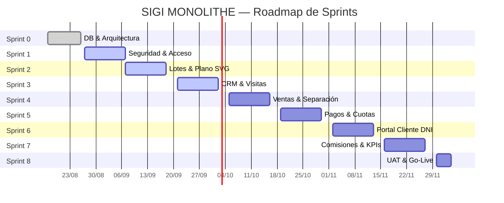

# Diagrama de Gantt — SIGI MONOLITHE
> **Fuente oficial:** `diagrama_gantt_sigi_monolithe.xml` (263 tareas, exportado desde GanttPRO)  
> **Inicio:** 17/08/2026 | **Fin:** 04/12/2026  
> **Total sprints:** 9 (Sprint 0 → Sprint 8)

---

## Cronograma General de Sprints

---

## Estado Actual (25/09/2026)

| Sprint | Período | Estado | % UI | % DB |
|---|---|---|---|---|
| **Sprint 0** | 17/08 – 26/08 | Completado | 100% | 100% |
| **Sprint 1** | 27/08 – 07/09 | Completado | 100% | 100% |
| **Sprint 2** | 07/09 – 18/09 | Completado | 100% | 100% |
| **Sprint 3** | 21/09 – 02/10 | En progreso (Semana 1) | 95% | 100% |
| **Sprint 4** | 05/10 – 16/10 | Proximo | 0% | 100% |
| **Sprint 5** | 19/10 – 30/10 | Planificado | 0% | 100% |
| **Sprint 6** | 02/11 – 13/11 | Planificado | 0% | 100% |
| **Sprint 7** | 16/11 – 27/11 | Planificado | 0% | 100% |
| **Sprint 8** | 30/11 – 04/12 | Planificado | 0% | 100% |

---

## Sprint 0 — Fundamentos, Base de Datos y Arquitectura
**Período:** 17/08/2026 – 26/08/2026 | **Horas:** 64h | **Estado:** COMPLETADO

| Categoría | Tarea | Inicio |
|---|---|---|
| Gestión | Definir objetivo general y objetivos específicos | 18/08 |
| Gestión | Definir alcance funcional del sistema | 19/08 |
| Gestión | Levantar procesos de negocio actuales | 18/08 |
| Gestión | Modelar procesos BPMN principales | 19/08 |
| Gestión | Definir actores y roles del negocio | 19/08 |
| Gestión | Definir requerimientos funcionales | 19/08 |
| Gestión | Definir requerimientos no funcionales | 19/08 |
| Gestión | Definir reglas de negocio | 19/08 |
| Gestión | Crear Product Backlog inicial | 20/08 |
| Gestión | Priorizar Product Backlog | 20/08 |
| Gestión | Definir criterios de aceptación generales | 24/08 |
| Arquitectura | Definir arquitectura inicial del sistema | 20/08 |
| Arquitectura | Definir estrategia de repositorio y ramas | 21/08 |
| Arquitectura | Configurar repositorio Git | 24/08 |
| Arquitectura | Configurar entornos de desarrollo | 24/08 |
| Arquitectura | Identificar riesgos iniciales del proyecto | 21/08 |
| Arquitectura | Construir Gantt | 24/08 |
| Base de Datos | Diseñar modelo conceptual de datos | 20/08 |
| Base de Datos | Diseñar modelo lógico de datos inicial | 20/08 |
| UX/UI | Definir mapa de navegación del sistema | 21/08 |
| UX/UI | Crear prototipos iniciales | 21/08 |
| Scrum | Sprint Review 0 | 26/08 |
| Scrum | Sprint Retrospective 0 | 26/08 |

---

## Sprint 1 — Seguridad y Acceso
**Período:** 27/08/2026 – 07/09/2026 | **Horas:** 80h | **Estado:** 90% COMPLETADO

| Categoría | Tarea | Inicio |
|---|---|---|
| Seguridad | Diseñar modelo de usuarios, roles y permisos | 27/08 |
| Seguridad | Crear tablas de usuarios, roles y permisos | 27/08 |
| Seguridad | Implementar autenticación de usuarios administrativos | 27/08 |
| Seguridad | Implementar autorización por roles | 28/08 |
| Seguridad | Implementar auditoría básica de accesos | 30/09 |
| Web Pública | Definir estructura de contenido de la web pública | 27/08 |
| Web Pública | Diseñar interfaz de la web pública | 27/08 |
| Web Pública | Implementar página de inicio | 27/08 |
| Web Pública | Implementar sección de proyectos | 28/08 |
| Web Pública | Implementar sección de beneficios y servicios | 28/08 |
| Web Pública | Implementar formulario de contacto | 29/08 |
| Web Pública | Integrar formulario con backend | 30/08 |
| Web Pública | Publicar web en entorno de pruebas | 01/09 |
| Backend CMS | Implementar CRUD de proyectos para CMS | 29/08 |
| Backend CMS | Implementar CRUD de páginas y secciones | 01/09 |
| Backend CMS | Implementar gestión básica de consultas web | 03/09 |
| Scrum | Sprint Planning 1 | 27/08 |
| Scrum | Sprint Review 1 | 05/09 |
| Scrum | Sprint Retrospective 1 | 05/09 |

---

## Sprint 2 — Catálogo Inmobiliario y Plano SVG
**Período:** 07/09/2026 – 18/09/2026 | **Horas:** 192h | **Estado:** 85% UI / 100% DB

| Categoría | Tarea | Inicio |
|---|---|---|
| Catálogo | Implementar gestión de proyectos inmobiliarios | 07/09 |
| Catálogo | Implementar gestión de manzanas | 08/09 |
| Catálogo | Implementar gestión de 70 lotes | 09/09 |
| Catálogo | Implementar estados de lote | 09/09 |
| Plano SVG | Implementar visualización SVG del plano | 10/09 |
| Plano SVG | Implementar filtros por estado en plano | 11/09 |
| Plano SVG | Implementar detalle de lote al hacer click | 12/09 |
| Plano SVG | Implementar tooltip con precio, área y estado | 12/09 |
| Scrum | Sprint Planning 2 | 07/09 |
| Scrum | Sprint Review 2 | 18/09 |
| Scrum | Sprint Retrospective 2 | 18/09 |

---

## Sprint 3 — CRM y Agenda de Visitas (ACTIVO)
**Período:** 21/09/2026 – 02/10/2026 | **Horas:** 80h | **Estado:** EN PROGRESO

| Categoría | Tarea | Inicio |
|---|---|---|
| CRM | Implementar seguimiento de prospectos | 21/09 |
| CRM | Implementar gestión de asesores en CRM | 22/09 |
| CRM | Implementar historial de interacciones | 23/09 |
| Agenda | Diseñar módulo de agenda de visitas al terreno | 21/09 |
| Agenda | Implementar registro de visita | 22/09 |
| Agenda | Implementar validación de horarios oficiales | 23/09 |
| Agenda | Implementar confirmación/cancelación de visita | 24/09 |
| Agenda | Implementar notificación de visita programada | 25/09 |
| DevOps | Configurar pipeline CI básico | 28/09 |
| QA | Pruebas de seguridad Sprint 1-2 | 29/09 |
| Scrum | Sprint Planning 3 | 21/09 |
| Scrum | Sprint Review 3 | 02/10 |
| Scrum | Sprint Retrospective 3 | 02/10 |

---

## Sprint 4 — Ventas y Separaciones
**Período:** 05/10/2026 – 16/10/2026 | **Horas:** 88h | **Estado:** Próximo

| Categoría | Tarea | Inicio |
|---|---|---|
| Separaciones | Diseñar flujo de separación de lote | 05/10 |
| Separaciones | Implementar registro de separación (S/ 500.00) | 06/10 |
| Separaciones | Implementar control de plazo de 7 días | 07/10 |
| Separaciones | Implementar caducidad automática de separación | 08/10 |
| Separaciones | Implementar reversión de lote a Disponible | 08/10 |
| Ventas | Implementar registro de venta al contado | 08/10 |
| Ventas | Implementar registro de venta financiada | 09/10 |
| Ventas | Implementar generación de contrato de compraventa | 10/10 |
| Ventas | Implementar formalización de cliente comprador | 12/10 |
| Ventas | Implementar entrega de documentos digitales | 13/10 |
| DevOps | Preparar entorno de despliegue versión 1 | 09/10 |
| DevOps | Desplegar versión 1 | 12/10 |
| DevOps | Verificar funcionamiento de versión 1 | 12/10 |
| Scrum | Sprint Review 4 | 16/10 |
| Scrum | Sprint Retrospective 4 | 16/10 |
| Informe | Levantar observaciones del APF1 | 05/10 |
| Informe | Preparar informe APF2 | 09/10 |

---

## Sprint 5 — Financiamiento, Cronograma y Vouchers
**Período:** 19/10/2026 – 30/10/2026 | **Horas:** 80h | **Estado:** Planificado

| Categoría | Tarea | Inicio |
|---|---|---|
| Financiamiento | Diseñar modelo de plan de financiamiento | 19/10 |
| Financiamiento | Implementar cálculo de intereses | 22/10 |
| Financiamiento | Generar cronograma de cuotas (hasta 36) | 23/10 |
| Financiamiento | Calcular saldo pendiente del cliente | 23/10 |
| Financiamiento | Clasificar cuotas: por vencer, vencidas, pagadas | 23/10 |
| Financiamiento | Implementar alerta de cuotas próximas a vencer | 26/10 |
| Financiamiento | Implementar cláusula de 3 cuotas consecutivas vencidas | 26/10 |
| Vouchers | Implementar carga de voucher | 23/10 |
| Vouchers | Implementar estado Pendiente del voucher | 23/10 |
| Vouchers | Implementar estado En validación del voucher | 26/10 |
| Vouchers | Implementar validación del voucher (Tesorería) | 26/10 |
| Vouchers | Implementar rechazo de voucher con motivo | 26/10 |
| Vouchers | Actualizar cuota pagada tras validación | 27/10 |
| Scrum | Sprint Review 5 | 30/10 |
| Scrum | Sprint Retrospective 5 | 30/10 |

---

## Sprint 6 — Portal del Cliente (Autoservicio DNI)
**Período:** 02/11/2026 – 13/11/2026 | **Horas:** 80h | **Estado:** Planificado

| Categoría | Tarea | Inicio |
|---|---|---|
| Portal | Diseñar pantalla de login del cliente | 02/11 |
| Portal | Implementar creación del usuario comprador | 03/11 |
| Portal | Implementar acceso con DNI | 03/11 |
| Portal | Generar contraseña inicial para cliente | 04/11 |
| Portal | Enviar credenciales iniciales por correo | 04/11 |
| Portal | Implementar recuperación y cambio de contraseña | 04/11 |
| Portal | Mostrar información del lote comprado | 05/11 |
| Portal | Mostrar cronograma de pagos | 05/11 |
| Portal | Mostrar cuotas vencidas y por vencer | 06/11 |
| Portal | Mostrar alertas de pago | 06/11 |
| Portal | Permitir descargar cronograma en PDF | 06/11 |
| Portal | Permitir descargar contrato | 06/11 |
| Portal | Permitir descargar memoria descriptiva | 06/11 |
| Portal | Mostrar cuentas bancarias para pagos | 09/11 |
| Portal | Mostrar nombre y teléfono del asesor asignado | 09/11 |
| Portal | Integrar formulario de carga de vouchers | 09/11 |
| Portal | Mostrar estado del voucher enviado | 09/11 |
| Portal | Mostrar motivo de rechazo del voucher | 09/11 |
| DevOps | Preparar despliegue de versión 2 | 10/11 |
| DevOps | Desplegar versión funcional | 13/11 |
| Scrum | Sprint Review 6 | 13/11 |
| Scrum | Sprint Retrospective 6 | 13/11 |

---

## Sprint 7 — Motor de Comisiones y Dashboard Gerencial
**Período:** 16/11/2026 – 27/11/2026 | **Horas:** 80h | **Estado:** COMPLETADO

| Categoría | Tarea | Inicio |
|---|---|---|
| Comisiones | Diseñar modelo de asesores internos y externos | 16/11 |
| Comisiones | Crear tablas de asesores, modalidades y horarios | 17/11 |
| Comisiones | Crear tablas de comisiones, bonos y descuentos | 17/11 |
| Comisiones | Implementar comisión 3% para venta al contado | 18/11 |
| Comisiones | Implementar comisión 2% para venta financiada | 19/11 |
| Comisiones | No permitir comisión por simple separación | 19/11 |
| Comisiones | Registrar bono para asesor contratado | 19/11 |
| Comisiones | Registrar sueldo del asesor contratado | 19/11 |
| Comisiones | Registrar horario part time / full time | 20/11 |
| Comisiones | Registrar faltas no justificadas | 20/11 |
| Comisiones | Calcular descuentos por faltas no justificadas | 20/11 |
| Comisiones | Mostrar historial de ventas por asesor | 20/11 |
| Finanzas | Consolidar ventas registradas | 19/11 |
| Finanzas | Consolidar pagos validados | 20/11 |
| Finanzas | Registrar pago de comisiones | 20/11 |
| Finanzas | Calcular balance ventas - comisiones | 20/11 |
| Dashboard | Definir KPIs principales | 18/11 |
| Dashboard | Implementar KPI de ventas | 23/11 |
| Dashboard | Implementar KPI de lotes disponibles/separados/vendidos | 23/11 |
| Dashboard | Implementar KPI de clientes por etapa comercial | 23/11 |
| Dashboard | Implementar KPI de cuotas vencidas y morosidad | 23/11 |
| Dashboard | Implementar KPI de comisiones | 23/11 |
| Dashboard | Implementar gráficos y filtros del dashboard | 23/11 |
| Scrum | Sprint Review 7 | 27/11 |
| Scrum | Sprint Retrospective 7 | 27/11 |

---

## Sprint 8 — UAT, Cierre y Go-Live
**Período:** 30/11/2026 – 04/12/2026 | **Horas:** 40h | **Estado:** COMPLETADO

| Categoría | Tarea | Inicio |
|---|---|---|
| UAT | Preparar plan de pruebas UAT | 30/11 |
| UAT | Ejecutar UAT con usuarios clave | 30/11 |
| UAT | Registrar observaciones de UAT | 30/11 |
| UAT | Corregir errores críticos detectados en UAT | 02/12 |
| UAT | Ejecutar pruebas de regresión | 02/12 |
| Documentación | Preparar manual de usuario | 01/12 |
| Documentación | Preparar manual técnico | 01/12 |
| DevOps | Preparar versión candidata final | 01/12 |
| DevOps | Ejecutar Go-Live / despliegue final | 01/12 |
| DevOps | Verificar funcionamiento post despliegue | 01/12 |
| Cierre | Registrar lecciones aprendidas | 01/12 |
| Cierre | Realizar retrospectiva final del proyecto | 01/12 |
| Cierre | Consolidar repositorio y entregables finales | 01/12 |
| Cierre | Cierre interno del proyecto | 01/12 |
| Informe | Levantar observaciones del APF3 | 30/11 |
| Informe | Preparar Informe de Proyecto Final | 01/12 |

---

## Integración con GanttPRO

El archivo fuente `diagrama_gantt_sigi_monolithe.xml` puede reimportarse en **GanttPRO**:
1. Acceder a [app.ganttpro.com](https://app.ganttpro.com)
2. **Import project** → formato **MS Project XML**
3. Seleccionar `docs/01_gestion_proyecto/diagrama_gantt_sigi_monolithe.xml`

> GanttPRO no expone API pública para sincronización automática bidireccional con GitHub Projects.
> La fuente operativa del equipo es **GitHub Projects** (tablero Kanban + Sprints).
