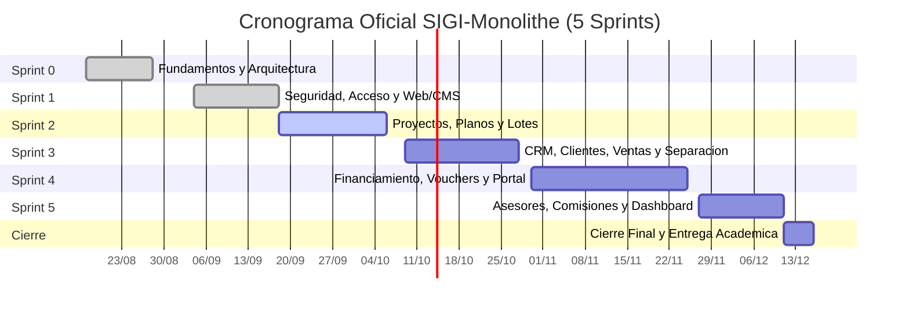

# DIAGRAMA DE GANTT — SGI-MONOLITHE (5 SPRINTS)

> **Fuente Oficial de la Verdad:** [Diagrama de Gantt - 5 sprints.pdf](file:///home/jhonataningesis/Documentos/Proyectos/Inmobiliaria/SGI-Monolithe/docs/Diagrama%20de%20Gantt%20-%205%20sprints.pdf)  
> **Archivo XML sincronizado:** [diagrama_gantt_sigi_monolithe.xml](file:///home/jhonataningesis/Documentos/Proyectos/Inmobiliaria/SGI-Monolithe/docs/01_gestion_proyecto/diagrama_gantt_sigi_monolithe.xml)  
> **Fecha de Corte:** 05/10/2026  
> **Duración Total:** 17/08/2026 – 16/12/2026 (18 semanas)  
> **Avance Global del Proyecto:** 35% ponderado acumulado

---

## 1. Cronograma Maestro de Sprints (Estructura Oficial)

```mermaid
gantt
    title Cronograma Oficial SIGI-Monolithe (5 Sprints)
    dateFormat DD/MM/YYYY
    axisFormat %d/%m

    section Sprint 0
    Fundamentos y Arquitectura       :done, s0, 17/08/2026, 28/08/2026

    section Sprint 1
    Seguridad, Acceso y Web/CMS      :done, s1, 04/09/2026, 18/09/2026

    section Sprint 2
    Proyectos, Planos y Lotes        :active, s2, 18/09/2026, 06/10/2026

    section Sprint 3
    CRM, Clientes, Ventas y Separacion :s3, 09/10/2026, 28/10/2026

    section Sprint 4
    Financiamiento, Vouchers y Portal:s4, 30/10/2026, 25/11/2026

    section Sprint 5
    Asesores, Comisiones y Dashboard :s5, 27/11/2026, 11/12/2026

    section Cierre
    Cierre Final y Entrega Academica :cierre, 11/12/2026, 16/12/2026
```

---

## 2. Resumen Ejecutivo por Sprint

| WBS | Sprint | Periodo | Enfoque Principal | Estado al 05/10/2026 |
|---|---|---|---|---|
| **1** | **Sprint 0** | 17/08/2026 – 28/08/2026 | Fundamentos, Arquitectura, BD inicial, BPMN y Product Backlog | **100% Completado** |
| **2** | **Sprint 1** | 04/09/2026 – 18/09/2026 | Seguridad JWT, RBAC, Auditoria, Web Publica y Modulo CMS | **100% Code / 36% Base** |
| **3** | **Sprint 2** | 18/09/2026 – 06/10/2026 | Catalogo, 70 lotes, Reglas de Precios, Plano SVG y Buscador | **En Cierre (Termina 06/10)** |
| **4** | **Sprint 3** | 09/10/2026 – 28/10/2026 | CRM, Seguimiento comercial, Separaciones (S/ 500) y Ventas | **Proximo (Inicia 09/10)** |
| **5** | **Sprint 4** | 30/10/2026 – 25/11/2026 | Pagos, Financiamiento TEA 0%, Vouchers y Portal del Comprador | **Planificado** |
| **6** | **Sprint 5** | 27/11/2026 – 11/12/2026 | Asesores, Comisiones (3% y 2%), Finanzas y Dashboard Gerencial | **Planificado** |
| **7** | **Cierre** | 11/12/2026 – 16/12/2026 | Verificacion post-despliegue, Retrospectiva y Entrega final | **Planificado** |

---

## 3. Desglose Detallado por Sprint

### Sprint 0 — Fundamentos, Base de Datos y Arquitectura
**Periodo:** 17/08/2026 – 28/08/2026 | **Estado:** 100% COMPLETADO

- **1.1 Gestion de proyecto y documentacion**:
  - Reunion inicial, actualizacion de acta de constitucion e identificacion de stakeholders (17/08 – 18/08).
  - Problema, oportunidad, justificacion, objetivos generales y especificos (18/08 – 19/08).
  - Levantamiento de procesos actuales, actores, requerimientos funcionales y no funcionales, reglas de negocio (18/08 – 24/08).
  - Modelado BPMN de procesos principales (24/08 – 26/08) por Adri Romero.
  - Creacion y priorizacion del Product Backlog (20/08 – 24/08).
  - Arquitectura del sistema, estrategia Git y riesgos iniciales (20/08 – 25/08).
  - Criterios de aceptacion, construccion del Gantt y configuracion de entornos (24/08 – 28/08).
- **1.2 Base de Datos**: Modelo logico y conceptual de datos inicial (20/08 – 24/08).
- **1.3 Diseno UX/UI**: Mapa de navegacion y prototipos iniciales (21/08 – 25/08).
- **1.4 Cierre**: Sprint Review 0 y Sprint Retrospective 0 (25/08 – 28/08).

---

### Sprint 1 — Seguridad, Acceso y Pagina Web / CMS
**Periodo:** 04/09/2026 – 18/09/2026 | **Estado:** COMPLETADO

- **2.1 Planificacion**: Sprint Planning 1 (04/09).
- **2.2 Seguridad y acceso**:
  - Modelo de usuarios, roles y permisos (04/09).
  - Tablas de usuarios y asignacion de permisos (04/09 – 07/09).
  - Autenticacion administrativa JWT y autorizacion por roles (04/09 – 11/09).
  - Auditoria basica de accesos y eventos (07/09 – 11/09).
- **2.3 Pagina Web Informativa y CMS**:
  - Estructura y diseno de la web publica (08/09 – 10/09).
  - Pagina de inicio, proyectos, beneficios y contacto (08/09 – 16/09).
  - **Especificacion Tecnica del Modulo CMS (Detalle de Avance)**:
    - **CMS publico (8%)**: Integrar `/api/public/paginas`, paginas por codigo y contenido visible del sitio.
    - **CMS administrativo (7%)**: Consultar paginas/contenido desde endpoints protegidos utilizando JWT.
    - **CRUD del CMS (10%)**: Crear, editar, activar/desactivar y actualizar contenido desde el frontend administrativo.
    - **Validacion completa CMS (5%)**: Loading, errores, formularios, permisos, respuestas 401/403/404, persistencia de cambios.
  - DevOps y despliegue version 1 (15/09 – 17/09) por Jhonatan Jesus G.
- **2.4 QA y pruebas**: Probar login, permisos, administracion y publicacion web (17/09 – 18/09).
- **2.5 Cierre**: Sprint Review 1 y Sprint Retrospective 1 (18/09).

---

### Sprint 2 — Inventario Inmobiliario, Planos y Lotes
**Periodo:** 18/09/2026 – 06/10/2026 | **Estado:** EN CIERRE (FINALIZA MAÑANA 06/10)

- **3.1 Planificacion**: Sprint Planning 2 (18/09).
- **3.2 Proyectos, planos y lotes**:
  - Estructura de proyectos, etapas, zonas, manzanas y 70 lotes (18/09 – 25/09).
  - Catalogo de estados de lote: Disponible, Separado, Vendido, Bloqueado (22/09 – 25/09).
  - Reglas de precios versionadas por zona, area, tipo y etapa comercial (22/09 – 25/09).
  - CRUD de proyectos, etapas y manzanas en backend y backoffice (21/09 – 29/09).
  - Representacion visual de la lotizacion y calculo dinamino de precios (24/09 – 02/10).
  - Filtros dinamicos por estado, etapa y zona (28/09 – 02/10).
  - Visualizacion vectorial SVG del plano, ficha de detalle y tooltip (28/09 – 05/10).
  - Sincronizacion bidireccional de estados y colores en mapa interactivo (29/09 – 05/10).
  - Buscador dinamico por numero de lote (29/09 – 05/10).
- **3.3 Documentacion**: Preparar informe de Sprint 2 (18/09 – 06/10).
- **3.4 DevOps**: Preparar version 2 y despliegue funcional en contenedores (28/09 – 05/10).
- **3.5 QA y Pruebas (Hito 06/10)**:
  - Probar reglas de precios y transicion de estados de lote (06/10).
  - Probar plano y buscador interactivo (06/10).
- **3.6 Cierre Scrum (Hito 06/10)**:
  - Sprint Review 2 (06/10).
  - Sprint Retrospective 2 (06/10).

---

### Sprint 3 — CRM, Clientes, Ventas y Separaciones
**Periodo:** 09/10/2026 – 28/10/2026 | **Estado:** PROXIMO A INICIAR (09/10)

- **4.1 Planificacion**: **Sprint Planning 3 (09/10/2026)**.
- **4.2 CRM y Clientes (09/10 – 20/10)**:
  - Disenar modelo de leads y clientes potenciales (09/10 – 13/10).
  - Tablas de leads, seguimientos comerciales y relacion cliente-asesor (12/10 – 14/10).
  - Conversion de Lead -> Potencial -> Comprador (15/10 – 20/10).
  - Filtros comerciales, exportacion a Excel y ficha del comprador (16/10 – 20/10).
- **4.3 Ventas y separaciones (16/10 – 27/10)**:
  - Diseno de modelo de separaciones y ventas formales (16/10 – 20/10).
  - Separacion preventiva de lote por S/ 500.00 con vigencia de 7 dias (20/10 – 22/10).
  - Liberacion automatica de lote por separacion vencida (22/10 – 23/10).
  - Venta al contado vs financiada y cambio de estado a Vendido (22/10 – 26/10).
  - Asignacion automatica de asesor personal y asociacion de contratos/planos (22/10 – 27/10).
  - Historial de transacciones del lote (22/10 – 27/10).
- **4.4 Seguridad**: Refuerzo de autorizacion y controles de seguridad (19/10 – 23/10).
- **4.5 Documentacion**: Documentar y preparar informe (09/10 – 28/10).
- **4.6 DevOps**: Preparar version 3 y despliegue (22/10 – 26/10).
- **4.7 QA y Pruebas**: Pruebas integrales de CRM, separaciones y ventas (26/10 – 28/10).
- **4.8 Cierre**: Sprint Review 3 y Retrospective 3 (28/10).

---

### Sprint 4 — Pagos, Financiamiento, Vouchers y Portal del Cliente
**Periodo:** 30/10/2026 – 25/11/2026 | **Estado:** PLANIFICADO

- **5.1 Planificacion**: Sprint Planning 4 (30/10).
- **5.2 Pagos y financiamiento (30/10 – 16/11)**:
  - Plan de financiamiento a 36 cuotas con TEA 0% e intereses moratorios.
  - Cronograma de amortizacion, calculo de saldos y semaforo de mora.
  - Alerta de vencimientos y clausula resolutoria por 3 cuotas consecutivas impagas.
- **5.3 Vouchers de pago (06/11 – 18/11)**:
  - Carga digital de comprobantes bancarios (hash SHA-256).
  - Flujo de estados: Pendiente -> En validacion -> Validado / Rechazado.
  - Amortizacion automatica de cuotas tras validacion de tesoreria.
- **5.4 Portal del cliente (09/11 – 23/11)**:
  - Login del comprador con DNI y gestion segura de credenciales iniciales.
  - Ficha de lote adjudicado, cronograma descargable en PDF, contratos y memoria descriptiva.
  - Cuentas bancarias de la empresa y carga autonoma de comprobantes.
- **5.5 Gestion de Servicios TI**: Procedimientos de soporte, accesos y control de cambios (30/10 – 20/11).
- **5.6 DevOps**: Preparacion y despliegue de version 4 (16/11 – 20/11).
- **5.7 QA y Cierre**: Pruebas de financiamiento, vouchers y portal; Sprint Review 4 (20/11 – 25/11).

---

### Sprint 5 — Asesores, Comisiones, Finanzas y Dashboard Gerencial
**Periodo:** 27/11/2026 – 11/12/2026 | **Estado:** PLANIFICADO

- **6.1 Planificacion**: Sprint Planning 5 (27/11).
- **6.2 Asesores y comisiones (27/11 – 07/12)**:
  - Modelo de asesores internos y externos, modalidades de contrato y horarios.
  - Motor de comisiones: 3% para venta al contado y 2% para venta financiada.
  - Regla estricta: No devengar comision por simple separacion (requiere contrato formal).
  - Bonos, sueldos base, faltas y calculo de descuentos.
- **6.3 Finanzas (30/11 – 07/12)**:
  - Consolidacion de ventas netas, pagos validados y balance financiero.
- **6.4 Dashboard gerencial (01/12 – 08/12)**:
  - KPIs ejecutivos: inventario de lotes, ventas acumuladas, morosidad y comisiones.
  - Graficos estadisticos y filtros analiticos consolidados.
- **6.5 Gestion de Servicios TI**: Incidentes, niveles de escalamiento y monitoreo (27/11 – 08/12).
- **6.6 DevOps**: Despliegue de version 5 en produccion (08/12 – 10/12).
- **6.7 QA y Cierre**: Pruebas integrales de liquidaciones y dashboard; Sprint Review 5 (10/12 – 11/12).

---

### Cierre Final del Proyecto y Entrega Academica
**Periodo:** 11/12/2026 – 16/12/2026 | **Estado:** PLANIFICADO

- Verificacion integral post-despliegue en produccion (11/12).
- Registro de lecciones aprendidas y retrospectiva global (11/12).
- Consolidacion de repositorio, documentacion y actas UAT (11/12).
- Cierre interno del proyecto y entrega academica final (11/12 – 16/12).
