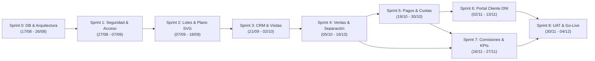

# DOCUMENTO MAESTRO DE REQUERIMIENTOS, REGLAS DE NEGOCIO Y SPRINTS
## SIGI MONOLITHE – Sistema Integral de Gestión Inmobiliaria
**Versión:** 2.0 (Alineación Oficial con Diagrama de Gantt XML y Base de Datos Supabase)  
**Estado:** Documento Oficial de Referencia (Única Fuente de la Verdad / SSOT)  
**Fecha de Publicación:** 4 de Septiembre de 2026  

---

## 1. Visión General y Alcance Tecnológico

**SIGI MONOLITHE** es la plataforma tecnológica centralizada para la gestión de proyectos de habilitación urbana e inmobiliaria, diseñada para optimizar el ciclo completo de negocio: desde la prospección de clientes y visualización de planos, hasta la formalización de ventas, financiamiento directo en cuotas y liquidación de comisiones.

### Stack Tecnológico Oficial
* **Frontend Web:** React 18 + TypeScript + Vite + Tailwind CSS (`apps/admin-dashboard` y `apps/portal-cliente`).
* **Backend & Base de Datos:** Supabase (PostgreSQL 17.6) en región `us-west-2` con Row Level Security (RLS) y extensiones `uuid-ossp` y `pgcrypto`.
* **Diseño UI/UX:** Prototipado en Figma y componentes con Framer Motion y Lucide Icons.
* **Modelo de Datos:** 102 tablas normalizadas y 181 índices de alto rendimiento.

---

## 2. Alineación Oficial de Sprints (Cronograma Gantt Maestro)

Este cronograma sincroniza el **Diagrama de Gantt XML** (263 tareas) con la realidad del desarrollo y la base de datos Supabase ya desplegada:

| Sprint | Fechas Oficiales | Horas | Objetivo Central y Entregables | Estado Actual |
|---|---|---|---|---|
| **Sprint 0** | **17/08/2026 – 26/08/2026** | 64h | **Fundamentos, Base de Datos y UX/UI:** Modelo entidad-relación de 102 tablas en Supabase, scripts de migración, catálogos iniciales y wireframes Figma. | **100% COMPLETADO** |
| **Sprint 1** | **27/08/2026 – 07/09/2026** | 80h | **Seguridad, Autenticación y Auditoría:** Login en ambas apps (`admin-dashboard` y `portal-cliente`), roles RBAC (`ADMIN`, `ASESOR`, `TESORERIA`, `CLIENTE`) y tabla `aud_eventos`. | **90% COMPLETADO** |
| **Sprint 2** | **07/09/2026 – 18/09/2026** | 192h | **Catálogo Inmobiliario y Plano SVG:** Gestión de proyectos, manzanas y los **70 lotes**. Plano interactivo vectorial SVG con filtros por estado (`Disponible`, `Separado`, `Vendido`, `Bloqueado`). | **85% UI / 100% DB** |
| **Sprint 3** | **21/09/2026 – 02/10/2026** | 80h | **CRM Inmobiliario y Agenda de Visitas:** Captura de prospectos (leads), embudo de conversión y módulo de agenda de visitas al terreno con validación de horarios oficiales. | **85% UI / 100% DB** |
| **Sprint 4** | **05/10/2026 – 16/10/2026** | 88h | **Ventas y Separaciones:** Registro de separación de **S/ 500.00**, control de plazo de **7 días calendario**, generación de contrato de compraventa y formalización de clientes. | **85% UI / 100% DB** |
| **Sprint 5** | **19/10/2026 – 30/10/2026** | 80h | **Financiamiento, Cronograma y Vouchers:** Generador de cronograma de pagos hasta **36 cuotas**, panel de tesorería para validar/rechazar comprobantes y detección de mora crítica. | **80% UI / 100% DB** |
| **Sprint 6** | **02/11/2026 – 13/11/2026** | 80h | **Portal del Cliente (Autoservicio DNI):** Extranet para compradores autenticados por DNI. Consulta de lote, cronograma de cuotas, subida de vouchers de depósito y contacto con su asesor. | **90% UI / 100% DB** |
| **Sprint 7** | **16/11/2026 – 27/11/2026** | 80h | **Motor de Comisiones y Dashboard:** Cálculo de comisiones (2% y 3%), balance de recaudación financiera y métricas gerenciales (KPIs). | **75% UI / 100% DB** |
| **Sprint 8** | **30/11/2026 – 04/12/2026** | 40h | **Cierre, Pruebas UAT y Despliegue Go-Live:** Pruebas integrales de usuario con la gerencia, hardening de seguridad y puesta en producción final. | **Planificado** |

---

## 3. Reglas de Negocio Oficiales (No Negociables)

### A. Inventario y Lotes
1. **Universo de Lotes:** El proyecto base comprende exactamente **70 lotes**.
2. **Determinación del Precio:** El precio base por $m^2$ y precio final varían por ubicación estratégica (esquina, frente a parque, acceso vehicular y área total).
3. **Ciclo de Vida del Lote:**
   $$\text{Disponible} \longrightarrow \text{Separado} \longrightarrow \text{Vendido}$$
   *(El estado `Bloqueado` se reserva para contingencias administrativas o legales).*

### B. Proceso de Separación y Venta
1. **Monto de Separación:** **S/ 500.00** exactos.
2. **Plazo de Vigencia:** **7 días calendario** a partir del registro del pago para cancelar la cuota inicial pactada.
3. **Cláusula de No Reembolso:** Si el comprador no completa la cuota inicial en el plazo de 7 días, la separación caduca automáticamente, el lote retorna al estado `Disponible` y el monto de S/ 500.00 **no es reembolsable**.

### C. Modalidades de Pago y Financiamiento
1. **Venta al Contado:**
   - Pago íntegro del lote.
   - Entrega: Contrato de Bien Futuro, copia de lotización marcada, memoria descriptiva y minuta para Escritura Pública.
2. **Venta Financiada Directa:**
   - Cuota inicial pactada + saldo financiado en hasta **36 cuotas mensuales (3 años)**.
   - Entrega: Contrato de Bien Futuro, memoria descriptiva y Cronograma Oficial de Pagos.
3. **Causal Resolutoria por Morosidad:**
   - La acumulación de **3 cuotas mensuales consecutivas impagas** faculta a la empresa a resolver el contrato de pleno derecho, revirtiendo la propiedad del lote a la inmobiliaria.

### D. Esquema de Liquidación de Comisiones
1. **Asesores Comisionistas (Externos):**
   - Venta al Contado: **3%** sobre el valor total de venta.
   - Venta Financiada: **2%** sobre el valor total de venta.
   - **Regla de Oro:** La comisión se devenga y liquida **únicamente cuando se firma el contrato formal de compraventa con inicial cancelada**, nunca con la simple separación preventiva.
2. **Asesores en Planilla (Fijos):**
   - Sueldo base mensual + bonos por metas comerciales de volumen.

### E. Operación de Visitas al Terreno
1. **Días Autorizados:** Lunes, Miércoles, Viernes y Sábados.
2. **Horarios Fijos:** 11:00 AM y 03:00 PM.
3. **Logística:** Ningún asesor puede agendar visitas fuera de estas franjas para garantizar transporte y seguridad en campo.

### F. Portal del Cliente (Extranet)
1. **Acceso Simplificado:** Autenticación directa mediante **número de DNI** y contraseña temporal asignada en la venta.
2. **Funcionalidades:**
   - Visualización de la ficha técnica de su lote.
   - Estado de cuenta y descarga del cronograma oficial de pagos.
   - Carga directa de vouchers o transferencias bancarias (estados: `Pendiente`, `Aprobado`, `Rechazado`).

---

## 4. Resolución Definitiva de Incoherencias y Módulos Descartados

Para garantizar que el equipo no trabaje en tareas redundantes ni sea evaluado sobre alcance irreal, se establecen las siguientes resoluciones:

| Incoherencia Previa en Documentos / Gantt | Decisión Arquitectónica y Alcance Real | Justificación Técnica |
|---|---|---|
| **Módulo de Gestión Documental Masiva (Sprint 7 antiguo)** | **DESCARTADO.** Se sustituye por almacenamiento simple de comprobantes (vouchers en imagen/PDF) y contratos en Supabase Storage. | Desarrollar un ECM masivo con OCR y versionado complejo ponía en riesgo la entrega del MVP y fue desaconsejado por el evaluador. |
| **Control Biométrico y Asistencia de RRHH (Gantt XML tareas 1.8.2.9 a 1.8.2.12)** | **ELIMINADO.** El sistema es un SIGI Inmobiliario, no un software de asistencia laboral. | Scope creep severo que inflaba el cronograma en el penúltimo sprint. |
| **Motor de CAD / Procesamiento OCR de Planos** | **SIMPLIFICADO A SVG INTERACTIVO.** El plano de los 70 lotes opera sobre un gráfico SVG con polígonos mapeados a la tabla `inm_lotes`. | Garantiza carga instantánea en web y móviles sin sobreingeniería de rendering pesado. |
| **Desfase de fechas en Sprint Planning 2 (`2026-10-07`)** | **CORREGIDO AL `2026-09-07`.** | Error tipográfico en el XML original corregido para mantener continuidad con el Sprint 1. |
| **Ramas duplicadas de Cierre en Gantt** | **UNIFICADO.** Se mantiene una única fase de UAT y Hardening en el Sprint 8. | Eliminación de redundancia de gestión. |

---

## 5. Mapeo del Sistema con las Aplicaciones en el Repositorio

| Módulo del Gantt | Vistas Implementadas en `apps/admin-dashboard` | Vistas en `apps/portal-cliente` | Tablas Principales Supabase |
|---|---|---|---|
| **Seguridad** | `src/pages/Login.tsx`, `UsersAndRoles.tsx` | `src/pages/Login.tsx` | `seg_usuarios`, `seg_roles`, `core_personas` |
| **Lotes y Planos** | `src/pages/Projects.tsx`, `LotMap.tsx` | `src/pages/portal/MiLote.tsx`, `PlanoProyecto.tsx` | `inm_proyectos`, `inm_lotes`, `inm_planos_interactivos` |
| **CRM & Leads** | `src/pages/Crm.tsx` | — | `crm_prospectos`, `crm_seguimientos` |
| **Ventas** | `src/pages/Sales.tsx` | — | `ven_reservas`, `ven_ventas`, `ven_contratos` |
| **Financiamiento** | `src/pages/Financing.tsx`, `Finance.tsx` | `src/pages/portal/Cronograma.tsx`, `Pagos.tsx` | `pag_planes_pago`, `pag_cuotas`, `pag_vouchers` |
| **Comisiones** | `src/pages/Advisors.tsx` | — | `com_asesores`, `com_comisiones` |
| **Dashboard** | `src/pages/Dashboard.tsx` | `src/pages/portal/Inicio.tsx` | `aud_eventos`, `fin_movimientos` |
