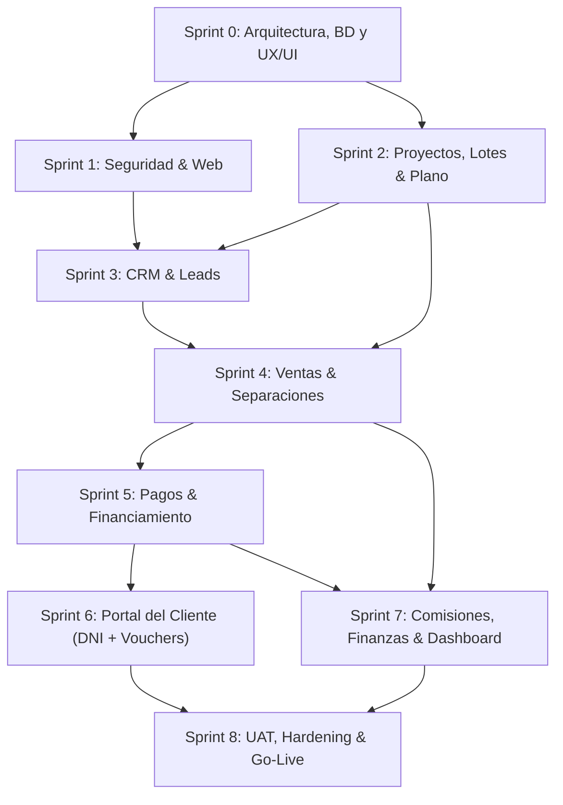

# ANÁLISIS PROFUNDO DEL DIAGRAMA DE GANTT (XML), INCOHERENCIAS Y REQUERIMIENTOS REALES

**Proyecto:** SIGI MONOLITHE – Sistema Integral de Gestión Inmobiliaria  
**Archivo Analizado:** `01_gestion_proyecto/diagrama_gantt_sigi_monolithe.xml` (263 tareas, 9 Sprints)  
**Evaluador:** Senior Software Engineer / Solutions Architect  
**Fecha:** 28 de Agosto de 2026  

---

## 1. Veredicto y Opinión General del Diagrama de Gantt XML

El archivo XML analizado representa una **evolución y refinamiento sustancial** respecto al cronograma inicial de Excel. Este nuevo diagrama demuestra que el equipo ya ha incorporado las reglas de negocio reales extraídas de las entrevistas/grabaciones (tales como la reserva de S/ 500, vigencia de 7 días, comisiones del 2% y 3%, mora de 3 cuotas consecutivas y el Portal del Cliente con acceso por DNI).

### Aspectos Positivos Destacados:
1. **Reestructuración Pragmática de Sprints:** Se eliminó el "Sprint 7 de Gestión Documental Masiva" (que era innecesariamente complejo y fue desaconsejado en la reunión) y se redistribuyó en una arquitectura más lógica orientada a la cadena de valor (Ventas -> Pagos -> Portal Cliente -> Comisiones/Dashboard).
2. **Unificación de Proyectos y Planos en el Sprint 2:** Resolver la jerarquía de proyectos/lotes junto con el plano interactivo en un solo sprint asegura consistencia en el modelo de datos.
3. **Inclusión de Entregables Académicos/Gobernanza:** Contempla los hitos de control APF1, APF2, APF3, DevOps, QA y Gestión de Servicios TI.

---

## 2. Detección de Incoherencias y Riesgos en el Gantt XML

A pesar de las mejoras, una auditoría técnica profunda revela **incoherencias temporales, sobrealcance (scope creep) y dependencias críticas**:

| # | Tipo de Incoherencia | Ubicación en el XML | Detalle y Evidencia Técnica | Riesgo e Impacto |
|---|---|---|---|---|
| **1** | **Incoherencia Temporal / Error de Fechas** | Sprint 2 (UID: 20) | La tarea `1.3.1 Scrum (Sprint Planning 2)` tiene fecha de inicio `2026-10-07`, mientras que las tareas de desarrollo (`1.3.2 Proyectos, planos y lotes`) inician el `2026-09-07`. | **Error de tipeo:** El Sprint Planning quedó desfasado 1 mes hacia adelante en el calendario. |
| **2** | **Sobrealcance en RRHH (Control de Asistencia)** | Sprint 7 (UID: 50) | Tareas `1.8.2.9` a `1.8.2.12`: *Registrar faltas no justificadas*, *Evaluación de justificación*, *Descuentos por faltas*. | **Scope Creep Severo:** Convierte un sistema inmobiliario en un software de control de asistencia biométrica/RRHH en el penúltimo sprint. |
| **3** | **Ambigüedad en "Página Web Informativa"** | Sprint 1 (UID: 17) | Asigna 56 horas al desarrollo de una web informativa (Landing page pública) en paralelo con Seguridad y Login. | **Distracción del Core:** En el Doc. Maestro se indicó que el foco MVP era el sistema transaccional interno (SIGI). La landing pública debe ser estática o quedar desacoplada. |
| **4** | **Duplicación de Tareas de Cierre** | Sprint 8 (UID: 56 y 59) | Existen dos ramas con el mismo nombre `Cierre y UAT` con tareas redundantes. | **Falta de limpieza:** Exportación con ramas duplicadas que inflan el número de tareas. |
| **5** | **Duplicación de Tareas de Seguridad** | Sprint 1 y Sprint 4 (UID: 16 y 32) | Seguridad se programa en el Sprint 1 (216h) y vuelve a aparecer en el Sprint 4 (48h). | La autorización de ventas debe ser parte intrínseca del Sprint 4, no tratada como un módulo de seguridad aislado. |

---

## 3. Análisis Profundo Sprint por Sprint (Relación y Dependencias)



---

### SPRINT 0: Fundamentos, Base de Datos y UX/UI
- **Fechas:** 17/08/2026 – 26/08/2026 | **Duración:** 64 horas
- **Relación con otros Sprints:** Es la base habilitadora. Sin el Modelo Entidad-Relación (DER) y la arquitectura Git/entornos, ningún sprint posterior puede iniciar.
- **Entregables Clave:**
  - Acta de constitución, matriz de stakeholders y alcance.
  - Modelo conceptual y lógico de base de datos (PostgreSQL/Supabase).
  - Configuración de repositorio GitHub/GitLab y ramas (`main`, `develop`, `feature/*`).
  - Wireframes y mapa de navegación en Figma.

---

### SPRINT 1: Seguridad, Autenticación y Landing Web
- **Fechas:** 27/08/2026 – 07/09/2026 | **Duración:** 216 horas
- **Relación:** Provee el middleware de autenticación (JWT / Sesiones) y RBAC (Control de Acceso Basado en Roles) que consumirán todos los módulos de gestión.
- **Entregables Clave:**
  - Login seguro, cierre de sesión, recuperación de contraseña.
  - Roles: `ADMINISTRADOR`, `GERENTE`, `ASESOR_COMERCIAL`, `TESORERIA`, `CLIENTE`.
  - Tabla inmutable de logs y auditoría (`usuario_id`, `accion`, `ip`, `timestamp`).
  - Landing informativa básica para captura de leads.

---

### SPRINT 2: Inventario Inmobiliario, Lotes y Plano Interactivo
- **Fechas:** 07/09/2026 – 18/09/2026 | **Duración:** 192 horas
- **Relación:** Define las entidades centrales del negocio (`Proyecto`, `Etapa`, `Manzana`, `Lote`). El CRM (Sprint 3) y Ventas (Sprint 4) dependen 100% de este inventario.
- **Entregables Clave:**
  - Catálogo CRUD de proyectos y manzanas.
  - Inventario de los **70 lotes** con área ($m^2$), linderos, precio base y estado (`Disponible`, `Separado`, `Vendido`, `Bloqueado`).
  - **Plano Interactivo:** Gráfico SVG interactivo con mapeo de polígonos por lote, visualización de colores por estado y modal de información al hacer clic.

---

### SPRINT 3: CRM Inmobiliario, Leads y Agenda de Visitas
- **Fechas:** 21/09/2026 – 02/10/2026 | **Duración:** 80 horas
- **Relación:** Captura la demanda comercial (prospectos). Al concretarse la intención de compra, el lead pasa al flujo de Venta/Separación (Sprint 4).
- **Entregables Clave:**
  - Registro de prospectos (leads) y asignación a asesores comerciales.
  - Embudo de conversión (*Contacto Inicial -> Interesado -> Visita Agendada -> Separación -> Cierre*).
  - **Agenda de Visitas al Terreno:** Restricción horaria por negocio (**Lunes, Miércoles, Viernes y Sábados** a las **11:00 AM y 03:00 PM**).
  - Exportación de cartera de clientes a Excel.

---

### SPRINT 4: Ventas, Separaciones (S/ 500) y Contratos
- **Fechas:** 05/10/2026 – 16/10/2026 | **Duración:** 88 horas
- **Relación:** Transforma un Lote `Disponible` a `Separado` o `Vendido`, y un Lead a `Cliente Comprador`. Habilita la generación de pagos (Sprint 5) y comisiones (Sprint 7).
- **Entregables Clave:**
  - **Módulo de Separación:** Registro de pago de **S/ 500.00** con vigencia de **7 días calendario** (no reembolsable).
  - Cron Job de liberación automática de lote si vencen los 7 días sin completar inicial.
  - Modalidad de Venta al Contado vs Venta Financiada.
  - Asociación de documentos de venta (Contrato de Bien Futuro, Memoria Descriptiva).

---

### SPRINT 5: Financiamiento, Cronograma de Pagos y Validación de Vouchers
- **Fechas:** 19/10/2026 – 30/10/2026 | **Duración:** 80 horas
- **Relación:** Gestiona la vida financiera del contrato a 3 años. Alimenta el estado de cuenta que el cliente verá en su portal (Sprint 6) y los ingresos de tesorería (Sprint 7).
- **Entregables Clave:**
  - Generador de Cronograma de Pagos (hasta 36 cuotas) con cálculo de intereses.
  - Clasificación de cuotas: `Por Vencer`, `Vencida`, `Pagada`.
  - **Regla de Mora Crítica:** Detección automática de **3 cuotas mensuales consecutivas impagas** para causal de rescisión.
  - Bandeja de Tesorería para revisión, aprobación o rechazo con motivo de comprobantes (vouchers).

---

### SPRINT 6: Portal del Cliente (Extranet con DNI)
- **Fechas:** 02/11/2026 – 13/11/2026 | **Duración:** 80 horas
- **Relación:** Es la interfaz de autoservicio para el comprador. Reduce la carga operativa de los asesores al permitir que el cliente consulte sus pagos y suba vouchers por sí mismo.
- **Entregables Clave:**
  - Login directo con número de DNI y contraseña generada.
  - Visualización del lote adquirido, linderos y estado.
  - Estado de cuenta y descarga del cronograma de pagos en PDF.
  - Subida de vouchers de depósito y seguimiento del estado (*Pendiente, En Validación, Aprobado, Rechazado*).
  - Ficha de contacto de su Asesor Personal asignado y cuentas bancarias oficiales.

---

### SPRINT 7: Liquidación de Comisiones, Finanzas y Dashboard Gerencial
- **Fechas:** 16/11/2026 – 27/11/2026 | **Duración:** 80 horas
- **Relación:** Consolida los datos generados en Ventas (Sprint 4) y Pagos (Sprint 5) para liquidar a los asesores y ofrecer analítica a la Gerencia.
- **Entregables Clave:**
  - **Motor de Comisiones:** 
    - Asesor comisionista: **3%** al contado / **2%** financiado.
    - Asesor en planilla: Sueldo base + bono.
    - Regla de negocio: **Prohibido liquidar comisión por simple separación** (solo con contrato formal).
  - Balance financiero (Ventas Totales vs Recaudación Real vs Comisiones Pagadas).
  - **Dashboard Ejecutivo:** KPIs de lotes vendidos/disponibles, morosidad global, efectividad de asesores y proyecciones.

---

### SPRINT 8: Pruebas UAT, Cierre, Hardening y Despliegue Go-Live
- **Fechas:** 30/11/2026 – 04/12/2026 | **Duración:** 40 horas
- **Relación:** Fase final de validación integral, corrección de bugs, pruebas con usuarios reales (UAT) y pase definitivo a producción.
- **Entregables Clave:**
  - Ejecución de pruebas de aceptación UAT con la administración de Monolithe.
  - Manual de usuario final y manual técnico de arquitectura.
  - Despliegue final en servidor de producción (Cloud/VPS/Vercel/Supabase).
  - Cierre formal del proyecto y lecciones aprendidas.

---

## 4. Matriz de los "Verdaderos Requerimientos" del Sistema

Sintetizando los documentos, el XML y las entrevistas reales, el catálogo consolidado de **Requerimientos Esenciales (Must Have)** es:

```
[RF-01] Autenticación y Control de Accesos RBAC (Admin, Gerente, Asesor, Tesorero, Cliente).
[RF-02] Trazabilidad y Auditoría de Operaciones Críticas.
[RF-03] Gestión de Catálogo de Proyectos, Manzanas y Lotes (70 lotes).
[RF-04] Visor Interactivo SVG de Lotes con actualización de estados en tiempo real.
[RF-05] CRM de Leads con Embudo de Conversión y Asignación de Asesores.
[RF-06] Agenda de Visitas al Terreno (L, M, V, S a las 11:00 AM y 3:00 PM).
[RF-07] Módulo de Separación de Lote por S/ 500 con caducidad a 7 días.
[RF-08] Venta al Contado y Generación de Venta Financiada (hasta 36 cuotas).
[RF-09] Motor de Cronograma de Pagos y Clasificación de Morosidad (Alerta a 3 meses).
[RF-10] Carga, Validación y Rechazo de Vouchers de Pago por Tesorería.
[RF-11] Portal del Cliente Comprador autenticado por DNI.
[RF-12] Motor de Liquidación de Comisiones (3% contado / 2% financiado al contrato).
[RF-13] Dashboard Gerencial con Indicadores Clave de Desempeño (KPIs).
```

---

## 5. Recomendación Ejecutiva para el Equipo

1. **Corregir la fecha errónea del Sprint 2 en el XML:** Cambiar `2026-10-07` por `2026-09-07` para la tarea de inicio de Sprint 2.
2. **Podar el módulo de RRHH/Asistencia en el Sprint 7:** Reemplazar el control de tardanzas y faltas de personal por un simple registro de bonos/descuentos manuales para evitar retrasar el cierre del proyecto.
3. **Mantener el Plano Interactivo en SVG:** No intentar procesar PDFs ni imágenes con algoritmos complejos; el SVG de 70 polígonos ya mapeados satisface el 100% de la necesidad de forma rápida y profesional.
